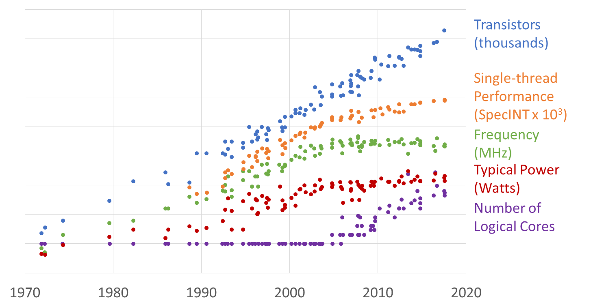
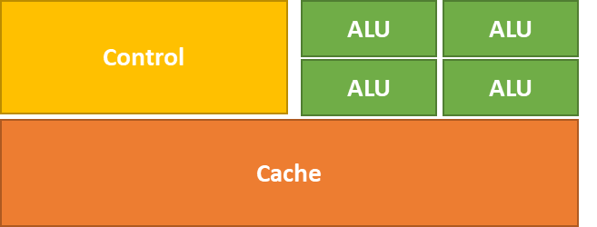
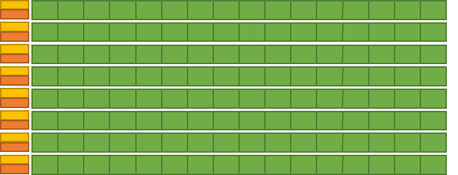

# 🚀 Processor Trends and Parallel Computing 🚀
🚀 Kicking Off the GPU Journey

> 🎉 **Welcome to the first step of GPU mastery challenge!**  
> We're diving deep into the world of parallel computing, starting from the very basics — buckle up and let's make some cores roar! ⚡

## 📈 Processor Evolution: From Moore's Law to Multi-core Era

### Moore's Law and Its Implications 🧩


**Moore's "Law"** 📊 predicted that the number of **transistors** per unit area would double every 18-24 months. This observation, made by Intel co-founder Gordon Moore in 1965, has shaped the semiconductor industry for decades.

#### Historical Progression ⏳

1. **Transistor Density** 🔍: Following Moore's prediction, chip manufacturers consistently increased the number of transistors packed onto silicon chips.

2. **Frequency Scaling** ⚡: Until around 2005, processor **frequency** (clock rate) increased proportionally because smaller transistors could be switched faster.

3. **The Power Wall** 🔥: Around 2005, frequency scaling hit the **power wall** - increasing frequency further would generate too much heat to cool effectively.

4. **Single-Thread Performance Plateau** 📉: With frequency stagnation came a flattening of **single-thread performance** gains, with modest improvements only coming from architectural optimizations and compiler advancements.



### The Multi-core Solution 🧠

As single-core performance improvements slowed, processor manufacturers shifted their focus to multi-core designs, placing multiple processing cores on a single chip. This transition marked the beginning of the parallel computing era for mainstream computing.

## 🏗️ Design Philosophies: Latency vs. Throughput

### Latency-Oriented Design 🏎️

**Focus: Minimize the time it takes to perform a single task**


### Throughput-Oriented Design 🚂

**Focus: Maximize the number of tasks that can be performed in a given time frame**


## 🧩 CPU vs. GPU: Architectural Comparison

### CPU: Latency-Oriented Design 💨

- ✅ A few powerful **ALUs** (Arithmetic Logic Units)
- ✅ Reduced operation latency
- ✅ Large **caches** to convert long latency memory accesses to short latency cache accesses
- ✅ Sophisticated **control** systems:
  - Branch prediction to reduce control hazards
  - Data forwarding to reduce data hazards
- ✅ Modest multithreading to hide short latency
- ✅ High clock frequency



### GPU: Throughput-Oriented Design 🌊

- ✅ Many small ALUs
- ✅ Long latency, high throughput operations
- ✅ Heavily pipelined for further throughput enhancement
- ✅ Small **caches** (more die area dedicated to computation)
- ✅ Simple **control** logic (more area dedicated to computation)
- ✅ Massive number of threads to hide very high latency
- ✅ Moderate clock frequency



## 📱 GPU Origins and Evolution

### From Graphics to General Purpose Computing 🎮

- 🎯 GPUs were originally built for graphics processing (Graphics Processing Unit)
- 🖼️ Graphics workloads naturally process a massive number of pixels in parallel
- 🧰 Before 2007, programming GPUs required graphics APIs like OpenGL and Direct3D
- 🔄 Using GPUs for non-graphics tasks meant reformulating computations as functions that paint pixels

### CUDA Revolution 💡

- 🚀 In 2007, NVIDIA released CUDA
- 🔓 Provided a programming interface for general-purpose GPU computing (GPGPU)
- 🛠️ Required extensions to the GPU architecture to enable more flexible computing

### Why GPUs Dominated Parallel Computing 📊

- 💰 Chip development is extremely expensive and requires high-volume sales
- 🎮 GPUs already had a large *installed base* from the gaming market
- 🏁 This gave them a significant head start compared to other parallel accelerators
- 📈 Economy of scale made GPUs cost-effective for scientific and data processing applications

## ⚖️ Amdahl's Law: The Limits of Parallelization

### The Parallel Computing Pitfall 🚧

Consider this example:
- Sequential execution time: **100** seconds
- Fraction of execution that is parallelizable: **90%**
- Speedup achieved on parallelizable part: **1000×**

What's the overall speedup?

```
t_parallel = (1-0.9)*100s + (0.9*100s)/1000 = 10s + 0.09s = 10.09s
speedup = t_sequential/t_parallel = 100s/10.09s = 9.91×
```

### Amdahl's Law Formalized 📝

For an application with:
- **t**: sequential execution time
- **p**: fraction of execution that is parallelizable
- **s**: speedup achieved on the parallelizable part

The overall speedup is:

```
t_parallel = (1-p)*t + (p*t)/s = (1-p+p/s)*t
speedup = t_sequential/t_parallel = t/((1-p+p/s)*t) = 1/(1-p+p/s)
```

As **s** approaches infinity, speedup approaches **1/(1-p)**


### Implications of Amdahl's Law 🔍

- ⚠️ Maximum speedup is limited by the fraction of execution that can't be parallelized
- 🧮 If **p** is 90%, speedup < 10× (no matter how many processors you add)
- 🌟 For many real applications, especially with large datasets, **p** > 99%
- 🚀 This enables speedups >100× for data-intensive applications

### Gustafson's Law: The Optimistic View 🌈

While Amdahl's Law seems pessimistic, Gustafson's Law suggests that as problem sizes grow, the parallel portion typically grows faster than the sequential portion, allowing for better scalability with larger problems.

## 📚 References

- Programming Massively Parallel Processors (PMPP)
- Computer Architecture: A Quantitative Approach
- NVIDIA CUDA Programming Guide
