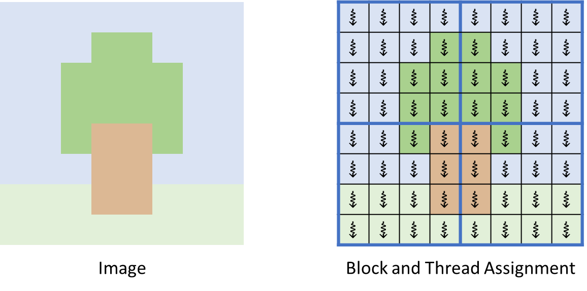
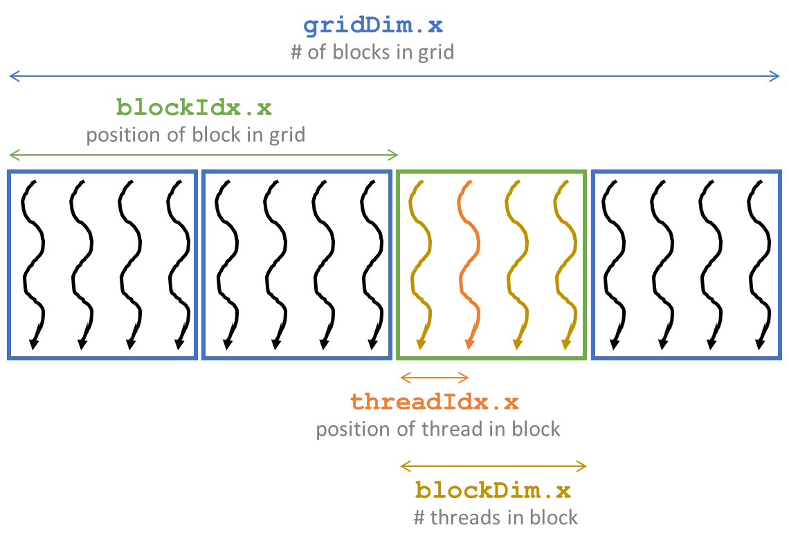
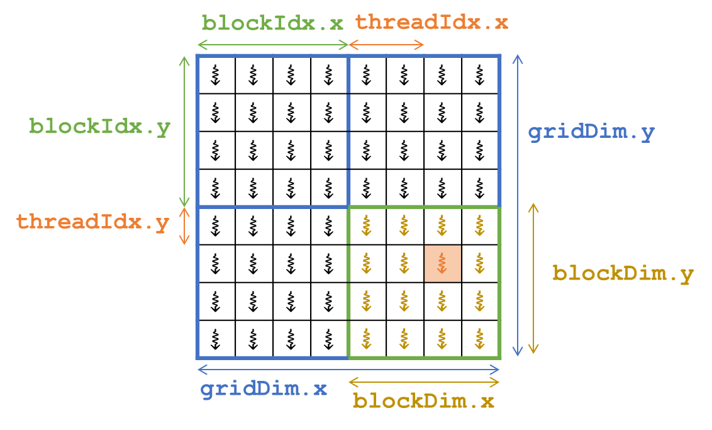
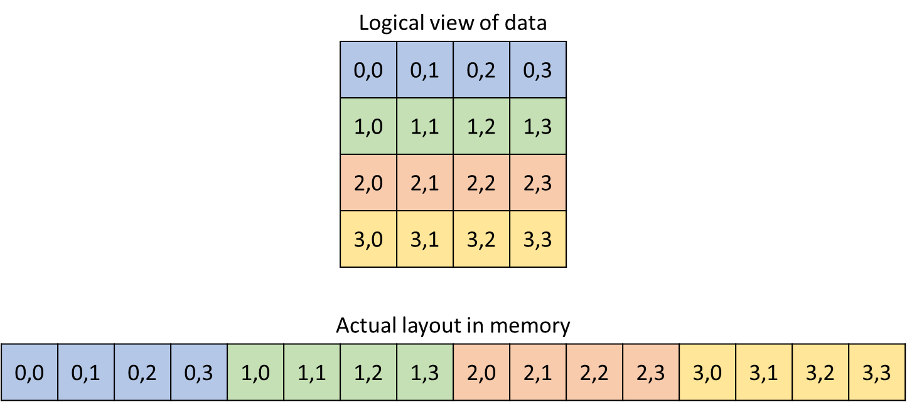
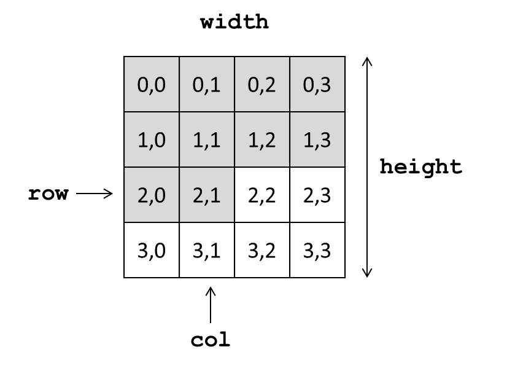

# 🚀 Day 004: Multidimensional Grids in CUDA 🚀
**100 Days of GPU Challenge**

Welcome to Day 4 of my 100 Days of GPU Challenge! Today we're exploring **Multidimensional Grids and Data** - fundamental concepts for efficient parallel programming on GPUs.

## 🎨 RGB to Grayscale Conversion


The classic example of parallel image processing: converting RGB images to grayscale.

**Parallelization approach:** 🧵 Assign one thread to convert each pixel in the image

```cuda
// Basic approach - one thread handles one pixel
gray[index] = red[index]*0.3 + green[index]*0.6 + blue[index]*0.1;
```

## 📊 Multidimensional Grids
The 2D grid of thread blocks maps naturally to image dimensions, making programming more intuitive.



### Key Benefits:
- 🔥 CUDA supports multidimensional grids (up to 3D)
- 🧩 Simplifies processing multidimensional data
- 📷 Perfect for image and matrix operations
- 🔄 Matches data structure to thread organization

## ⚙️ Configuring Multidimensional Grids

CUDA provides a simple way to define multidimensional grids using the built-in `dim3` type:

```cuda
// Define a 2D block of threads (32×32 threads per block)
dim3 numThreadsPerBlock(32, 32);

// Calculate how many blocks we need to cover the entire image
dim3 numBlocks(
    (width + numThreadsPerBlock.x - 1) / numThreadsPerBlock.x,
    (height + numThreadsPerBlock.y - 1) / numThreadsPerBlock.y
);

// Launch the kernel with our 2D grid configuration
rgb2gray_kernel <<< numBlocks, numThreadsPerBlock >>> (red_d, green_d, blue_d, gray_d, width, height);
```

## 🔍 One Dimensional Indexing (Previous Method)



Previously, we might have used a one-dimensional grid and manually calculated 2D positions:

```cuda
__global__ void oldKernel(unsigned char* input, unsigned char* output, int width, int height) {
    int idx = blockIdx.x * blockDim.x + threadIdx.x;
    
    if (idx < width * height) {
        int row = idx / width;
        int col = idx % width;
        // Process pixel at (row, col)
    }
}
```

This approach works but doesn't align naturally with the 2D nature of many problems.

## 🌟 Multidimensional Indexing 



CUDA provides built-in dimension and index variables for multidimensional addressing:

### Key Variables:

| Variable | Description |
|----------|-------------|
| `blockIdx.{x,y,z}` | Block indices in x, y, z dimensions |
| `threadIdx.{x,y,z}` | Thread indices within a block |
| `blockDim.{x,y,z}` | Block dimensions (threads per block) |
| `gridDim.{x,y,z}` | Grid dimensions (blocks per grid) |

## 💻 Multidimensional Indexing Example

```cuda
__global__ void rgb2gray_kernel(
    unsigned char* red, 
    unsigned char* green, 
    unsigned char* blue,
    unsigned char* gray, 
    unsigned int width, 
    unsigned int height
) {
    // Calculate 2D position directly using built-in variables
    unsigned int row = blockIdx.y * blockDim.y + threadIdx.y;
    unsigned int col = blockIdx.x * blockDim.x + threadIdx.x;

    // Convert the pixel
    // ...
}
```

### 🧱 Layout of Multidimensional Data

C/C++ convention is to store data in row-major order:
- Elements in the same row are contiguous in memory
- Moving right in the matrix means moving to the next memory location
- Moving down means jumping ahead by the width of the row
   


## 🔢 Accessing Multidimensional Data

When working with multidimensional data stored in linear memory, we use this formula:

```
index = row * width + col
```

This formula converts 2D coordinates to the appropriate 1D memory location.



## 🧠 Complete RGB to Grayscale Example

```cuda
__global__ void rgb2gray_kernel(
    unsigned char* red, 
    unsigned char* green, 
    unsigned char* blue,
    unsigned char* gray, 
    unsigned int width, 
    unsigned int height
) {
    // Calculate 2D position
    unsigned int row = blockIdx.y * blockDim.y + threadIdx.y;
    unsigned int col = blockIdx.x * blockDim.x + threadIdx.x;

    // Convert the pixel
    unsigned int idx = row * width + col;
    
    if (row < height && col < width) {
        gray[idx] = red[idx] * 0.3 + green[idx] * 0.6 + blue[idx] * 0.1;
    }
}
```

## ⚠️ Boundary Conditions


An important consideration: there could be more threads than pixels in both dimensions!

```cuda
__global__ void rgb2gray_kernel(
    unsigned char* red, 
    unsigned char* green, 
    unsigned char* blue,
    unsigned char* gray, 
    unsigned int width, 
    unsigned int height
) {
    unsigned int row = blockIdx.y * blockDim.y + threadIdx.y;
    unsigned int col = blockIdx.x * blockDim.x + threadIdx.x;

    // Handle boundary conditions - only process valid pixels
    if (row < height && col < width) {
        unsigned int idx = row * width + col;
        gray[idx] = red[idx] * 0.3 + green[idx] * 0.6 + blue[idx] * 0.1;
    }
}
```

## 📝 Best Practices for Multidimensional Processing

- ✅ Use 2D grids for 2D data (images, matrices)
- ✅ Always check boundary conditions
- ✅ Choose block dimensions that are multiples of 32 (warp size)
- ✅ Consider shared memory for performance optimization
- ✅ Balance block size for occupancy and data reuse

## 🛠️ Troubleshooting: CUDA Version Mismatch on Google Colab

While working with a Tesla T4 GPU on Google Colab, I encountered a **CUDA version mismatch** that blocked proper compilation. Here's how I resolved it:

### 🚨 The Problem

Conflicting CUDA versions between the compiler and driver:

```bash
$ nvcc --version
Cuda compilation tools, release 12.5, V12.5.82

$ nvidia-smi
Driver Version: 550.54.15
CUDA Version: 12.4
```

### ❓ Root Cause

Colab had installed CUDA toolkit 12.5, but the T4 GPU driver only supported CUDA 12.4, creating an incompatibility between compiler expectations and GPU capabilities.

### ✅ Solution

I reinstalled **CUDA 12.4.1** to match the driver version:

```bash
# 1. Remove existing CUDA installation
!sudo rm -rf /usr/local/cuda*

# 2. Download and install CUDA 12.4.1 toolkit
!wget https://developer.download.nvidia.com/compute/cuda/12.4.1/local_installers/cuda_12.4.1_550.54.15_linux.run
!chmod +x cuda_12.4.1_550.54.15_linux.run
!sudo ./cuda_12.4.1_550.54.15_linux.run --silent --toolkit

# 3. Update environment variables
import os
os.environ["PATH"] = "/usr/local/cuda/bin:" + os.environ["PATH"]
os.environ["LD_LIBRARY_PATH"] = "/usr/local/cuda/lib64:" + os.environ.get("LD_LIBRARY_PATH", "")

# 4. Verify the fix
!nvcc --version
```

After applying these steps, `nvcc` correctly showed CUDA 12.4, and my CUDA code compiled successfully.

## 🔗 Further Resources

- [CUDA Programming Guide](https://docs.nvidia.com/cuda/cuda-c-programming-guide/)
- [CUDA Best Practices Guide](https://docs.nvidia.com/cuda/cuda-c-best-practices-guide/)
- [Parallel Programming in CUDA](https://developer.nvidia.com/blog/even-easier-introduction-cuda/)
- [CUDA Samples Repository](https://github.com/NVIDIA/cuda-samples)

---
