# 🚀 Day 008 of 100 Days of GPU: CUDA Memory Transfer Performance Mastery

> *"In GPU computing, memory is the highway, and data is the traffic. Optimize the highway, and your data flows smoothly!"* 🛣️⚡

## 📋 Today's Learning Objectives

By the end of this lesson, you will:
- 🧠 Understand **memory types**: Pageable, Pinned, Device, and Unified
- 📊 Analyze **performance benchmarks**: Real-world transfer speeds and efficiencies
- 🎯 Apply **optimization strategies**: Techniques to accelerate memory transfers
- 🔄 Master **async patterns**: Overlapping computation with data movement

---

## 🖥️ Test Environment Setup

### Hardware Specifications 🏎️
```
🎮 GPU: NVIDIA Tesla T4
🔧 Memory Clock: 5,001 MHz
📏 Memory Bus Width: 256 bits
⚡ Peak Memory Bandwidth: 320.1 GB/s
🔌 PCIe Interface: PCIe 3.0 x16 (~15.75 GB/s effective bidirectional)
```
### Test Parameters 📐
```
📦 Data Size: 100 MB per transfer
🔄 Iterations: 100 runs (averaged)
⏱️ Timing Method: CUDA events (high-precision GPU timing)
🎛️ Transfer Modes: Synchronous and Asynchronous
```
**Improvement**: Specified the number of iterations (100) for reproducibility and clarified that CUDA events provide high-precision timing, enhancing scientific rigor.

---

## 🧠 Memory Architecture Deep Dive

### Memory Hierarchy Visualization 📊


**Explanation**: This diagram illustrates the memory hierarchy in a CUDA system. The CPU accesses System RAM, which hosts Pageable Memory (slower, swappable by the OS) and Pinned Memory (faster, locked for Direct Memory Access). The PCIe Bus connects System RAM to the GPU, which has its own high-speed GPU Memory. Unified Memory is a shared space managed by CUDA, accessible by both CPU and GPU, simplifying data management but with variable performance.

### 📌 Memory Types Comparison

| Memory Type | 🏠 Location       | 🔒 Locked | 🚀 Speed  | ⏳ Allocation Overhead |
|-------------|-------------------|-----------|-----------|-----------------------|
| **Pageable** | System RAM       | ❌ No     | 🐌 Slow   | 💚 Low                |
| **Pinned**   | System RAM       | ✅ Yes    | 🏃 Fast   | 💛 Medium             |
| **Device**   | GPU Memory       | ✅ Yes    | 🚀 Fastest| 💙 High               |
| **Unified**  | Shared (CPU+GPU) | ✅ Yes    | 🏃 Fast   | 💜 Variable           |

**Explanation**: This table compares CUDA memory types. Pageable Memory has low overhead but slow transfers due to OS management. Pinned Memory, locked in RAM, offers faster transfers with moderate overhead. Device Memory, on the GPU, is the fastest but has high allocation overhead. Unified Memory, shared between CPU and GPU, has variable overhead depending on access patterns.

---

## 📊 Performance Benchmark Results

### Complete Performance Table 🏆

| Transfer Type                | ⏱️ Time (ms) | 🚀 Bandwidth (GB/s) | 📈 Efficiency (% of Peak) |
|------------------------------|--------------|---------------------|--------------------------|
| 🖥️ Host-to-Host (CPU memcpy) | 69.37        | 1.51                | N/A                      |
| ⬆️ Host-to-Device Sync (Pinned) | 11.58     | **8.44**            | 54% (PCIe)              |
| ⬇️ Device-to-Host Sync (Pinned) | 10.08     | **9.69**            | 62% (PCIe)              |
| 🔄 Device-to-Device Sync     | 0.87         | **111.79**          | 35% (GPU Mem)           |
| ⬆️ Host-to-Device Async (Pinned) | 11.46   | **8.52**            | 54% (PCIe)              |
| ⬇️ Device-to-Host Async (Pinned) | 10.00   | **9.77**            | 62% (PCIe)              |
| 🔄 Device-to-Device Async    | 0.86         | **113.64**          | 36% (GPU Mem)           |
| ⬇️ Device-to-Host (Pageable) | 71.45        | 1.37                | 9% (PCIe)               |
| ⬆️ Host-to-Device (Pageable) | 22.65        | 4.31                | 27% (PCIe)              |
| 🌐 Unified Memory Access     | 0.87         | **112.57**          | 35% (GPU Mem)           |
| 🗺️ Mapped Memory Access      | 15.43        | 6.33                | 40% (PCIe)              |
| 🔀 Device-to-Device Multi-Stream | 0.88     | **111.18**          | 35% (GPU Mem)           |

**Explanation**: This table shows transfer performance for a 100 MB data size. Bandwidth is calculated as (Size / Time), and efficiency compares achieved bandwidth to theoretical peaks (15.75 GB/s for PCIe, 320.1 GB/s for GPU memory). Pinned memory outperforms pageable significantly, while device-to-device transfers leverage GPU memory bandwidth.

### Performance Visualization 📈


**Explanation**: This bar chart displays transfer times for a 100 MB transfer across different types (D2D = Device-to-Device, H2D = Host-to-Device, D2H = Device-to-Host). Shorter bars indicate faster transfers. Device-to-device transfers are near-instantaneous (<1 ms), while pageable memory transfers are significantly slower, especially Device-to-Host (71.45 ms).

---

## 🔍 Performance Analysis Deep Dive

### 1. 📌 The Pinned Memory Advantage

```mermaid
flowchart LR
    A[📄 Pageable Memory] --> B[🐌 OS Staging Buffer]
    B --> C[📋 Multiple Copies]
    C --> D[🎮 GPU]
    E[📌 Pinned Memory] --> F[⚡ Direct DMA]
    F --> D
    style A fill:#ff4444,color:#fff
    style E fill:#00cc66,color:#fff
    style F fill:#0099ff,color:#fff
```



**Explanation**: This flowchart contrasts pageable and pinned memory transfers. Pageable memory requires copying to an OS buffer, adding overhead. Pinned memory enables Direct Memory Access (DMA), bypassing the CPU for faster transfers.

**Performance Gains**:
- **Host-to-Device**: Pinned is 1.96x faster (4.31 vs. 8.44 GB/s)
- **Device-to-Host**: Pinned is 6.77x faster (1.37 vs. 9.69 GB/s)

### 2. 🔌 PCIe Bandwidth Utilization


**Explanation**: This pie chart breaks down PCIe 3.0 x16 bandwidth (15.75 GB/s) during a pinned Host-to-Device transfer (8.44 GB/s). Only 54% is used for data, with the rest lost to protocol overhead (e.g., packet headers), alignment issues, and driver overhead.

### 3. 🎮 Device-to-Device Performance

```mermaid
graph LR
    A[⚡ Theoretical Peak<br/>320.1 GB/s] --> B{What Limits Us?}
    B --> C[🔄 Access Patterns]
    B --> D[🛡️ ECC Overhead]
    B --> E[🌡️ Thermal Limits]
    B --> F[🧩 Memory Fragmentation]
    C --> G[📊 Actual Performance<br/>~113 GB/s]
    D --> G
    E --> G
    F --> G
```



**Explanation**: This diagram shows why device-to-device transfers achieve ~113 GB/s instead of 320.1 GB/s. Factors like inefficient access patterns, ECC overhead (e.g., ~12.5% on Tesla GPUs), thermal throttling, and memory fragmentation reduce effective bandwidth.

### 4. 🔄 Sync vs Async Performance


**Explanation**: This bar chart compares synchronous (blue) and asynchronous (orange) transfer bandwidths. Async offers slight gains (e.g., 8.44 to 8.52 GB/s for H2D), but its real benefit is enabling computation overlap, not shown here.

---

## 🛠️ Optimization Strategies & Best Practices

### 🏆 Performance Hierarchy

```mermaid
graph TD
    A[🥇 D2D<br/>113+ GB/s] --> B[🥈 Unified<br/>112+ GB/s]
    B --> C[🥉 Pinned H2D/D2H<br/>8-10 GB/s]
    C --> D[📍 Mapped<br/>6+ GB/s]
    D --> E[🐌 Pageable H2D/D2H<br/>1-4 GB/s]
    style A fill:#ffd700,color:#000
    style B fill:#c0c0c0,color:#000
    style C fill:#cd7f32,color:#fff
    style D fill:#ff9800,color:#fff
    style E fill:#ff4444,color:#fff
```



**Explanation**: This hierarchy ranks transfer speeds. Device-to-Device (D2D) is fastest, followed by Unified Memory, Pinned Host-to-Device/Device-to-Host, Mapped Memory, and Pageable transfers.

### 🎯 When to Use Each Memory Type

- **Device-to-Device**: `cudaMemcpy(d_output, d_input, size, cudaMemcpyDeviceToDevice)`  
  **Use When**: Data stays on GPU (e.g., iterative computations).
- **Pinned Memory**: `cudaMallocHost(&h_pinned, size)`  
  **Use When**: Frequent host-GPU transfers (e.g., streaming data).
- **Unified Memory**: `cudaMallocManaged(&unified_data, size)`  
  **Use When**: Mixed CPU/GPU access or prototyping.

### 💡 Advanced Techniques

#### 1. 📦 Batch Small Transfers

**Explanation**: Batching reduces per-transfer overhead (e.g., driver calls), improving efficiency.

#### 2. ⚡ Async Overlap

**Explanation**: Multiple streams allow transfers and kernels to overlap, maximizing GPU utilization.

#### 3. ♻️ Memory Pool
```cuda
class PinnedMemoryPool {
    std::vector<void*> buffers;
public:
    void* get_buffer(size_t size);
    void return_buffer(void* ptr);
};
```
**Explanation**: Pre-allocating pinned memory reduces allocation overhead in performance-critical loops.

---

## 🎯 The 10x Performance Rules

1. **🚀 Keep Data GPU-Side**: Minimize host-GPU transfers.  
2. **📌 Use Pinned Memory**: 6.77x faster D2H, 1.96x faster H2D.  
3. **🔄 Overlap Operations**: Use async transfers and streams.

---

## 🏃‍♂️ Quick Reference Cheat Sheet

### 🚀 Speed Rankings
1. D2D: 113+ GB/s 🥇
2. Unified: 112+ GB/s 🥈
3. Pinned H2D/D2H: 8-10 GB/s 🥉
4. Pageable H2D/D2H: 1-4 GB/s 🐌

### 🛠️ Optimization Checklist
- ✅ Use pinned memory
- ✅ Batch transfers
- ✅ Overlap with async
- ✅ Pre-allocate pools

### 🚫 Pitfalls
- ❌ Pageable for frequent transfers
- ❌ Small, unbatched transfers

---

## 🎉 Key Takeaways

- **Pinned Memory**: Boosts host-GPU transfers.
- **Async Overlap**: Enhances scheduling.
- **Device Memory**: Maximizes bandwidth.

## 📚 Resources
- [CUDA Best Practices Guide](https://docs.nvidia.com/cuda/cuda-c-best-practices-guide/)
- [CUDA C++ Programming Guide](https://docs.nvidia.com/cuda/cuda-c-programming-guide/)
- [CUDA Samples](https://github.com/NVIDIA/cuda-samples)
