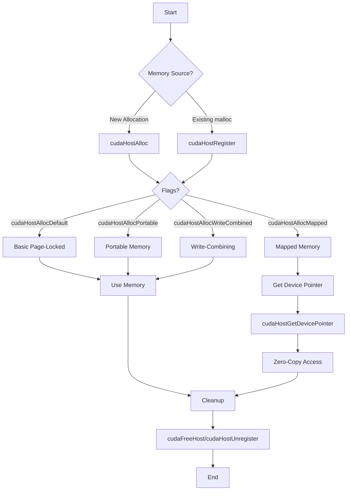
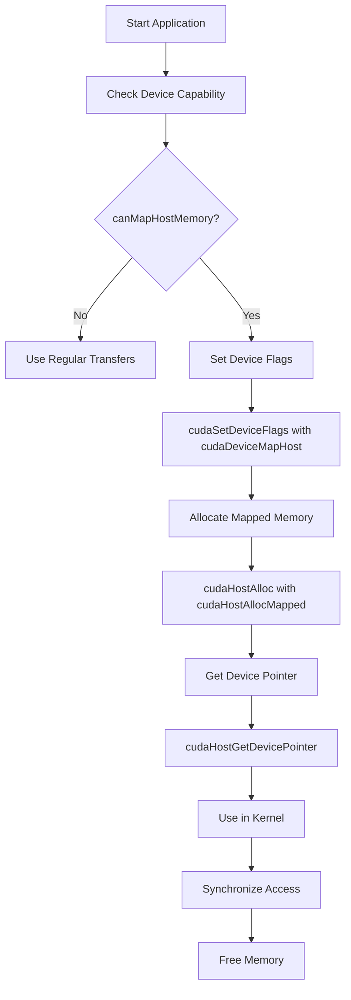
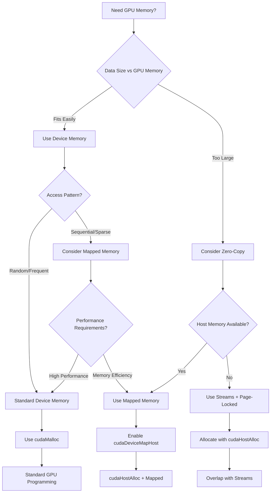

# 🌟 Day 009 of 100 Days of GPU: CUDA Page-Locked Host Memory

## Table of Contents
1. [Introduction](#introduction)
2. [Understanding Memory Types](#understanding-memory-types)
3. [Page-Locked Memory Functions](#page-locked-memory-functions)
4. [Benefits of Page-Locked Memory](#benefits-of-page-locked-memory)
5. [Portable Memory](#portable-memory)
6. [Write-Combining Memory](#write-combining-memory)
7. [Mapped Memory](#mapped-memory)
8. [Implementation Examples](#implementation-examples)
9. [Performance Comparison](#performance-comparison)
10. [Best Practices](#best-practices)
11. [Troubleshooting](#troubleshooting)

---

## Introduction

Page-locked (pinned) host memory is a crucial optimization technique in CUDA programming that can significantly improve memory transfer performance and enable advanced features like zero-copy access. This comprehensive guide explores all aspects of page-locked memory with detailed explanations, diagrams, and practical examples.

### What is Page-Locked Memory?

Page-locked memory refers to host memory that is "pinned" in physical RAM and cannot be swapped to disk by the operating system's virtual memory manager. This differs from regular pageable memory allocated by functions like `malloc()`, which can be moved around in physical memory or swapped to disk.

```
┌─────────────────────────────────────────────────────────────┐
│                    Host Memory Types                        │
├─────────────────────────────────────────────────────────────┤
│                                                             │
│  ┌─────────────────────┐    ┌─────────────────────────────┐ │
│  │   Pageable Memory   │    │    Page-Locked Memory       │ │
│  │  (malloc, new)      │    │   (cudaHostAlloc)           │ │
│  │                     │    │                             │ │
│  │ • Can be swapped    │    │ • Cannot be swapped         │ │
│  │ • Virtual addresses │    │ • Fixed physical location   │ │
│  │ • OS managed        │    │ • Direct GPU access        │ │
│  │ • Slower transfers  │    │ • Faster transfers          │ │
│  └─────────────────────┘    └─────────────────────────────┘ │
│                                                             │
└─────────────────────────────────────────────────────────────┘
```

---

## Understanding Memory Types

### Memory Hierarchy Visualization

```
┌─────────────────────────────────────────────────────────────┐
│                    CUDA Memory Hierarchy                    │
└─────────────────────────────────────────────────────────────┘

    CPU Side                           GPU Side
┌─────────────────┐                ┌─────────────────┐
│                 │                │                 │
│ ┌─────────────┐ │   PCIe Bus     │ ┌─────────────┐ │
│ │ CPU Cache   │ │ ════════════▶  │ │ GPU Cache   │ │
│ └─────────────┘ │                │ └─────────────┘ │
│                 │                │                 │
│ ┌─────────────┐ │                │ ┌─────────────┐ │
│ │ System RAM  │ │                │ │ Device Mem  │ │
│ │             │ │                │ │             │ │
│ │ ┌─────────┐ │ │                │ │ ┌─────────┐ │ │
│ │ │Pageable │ │ │                │ │ │ Global  │ │ │
│ │ │ Memory  │ │ │                │ │ │ Memory  │ │ │
│ │ └─────────┘ │ │                │ │ └─────────┘ │ │
│ │             │ │                │ │             │ │
│ │ ┌─────────┐ │ │                │ │ ┌─────────┐ │ │
│ │ │Page-Loc │ │ │◀═══════════════│ │ │ Shared  │ │ │
│ │ │ Memory  │ │ │   Zero Copy    │ │ │ Memory  │ │ │
│ │ └─────────┘ │ │                │ │ └─────────┘ │ │
│ └─────────────┘ │                │ └─────────────┘ │
└─────────────────┘                └─────────────────┘
```

### Memory Transfer Comparison

```
┌─────────────────────────────────────────────────────────────┐
│              Memory Transfer Performance                    │
├─────────────────────────────────────────────────────────────┤
│                                                             │
│ Pageable Memory Transfer:                                   │
│ Host ────▶ Staging ────▶ Device                            │
│      (slow)       (fast)                                   │
│                                                             │
│ Page-Locked Memory Transfer:                                │
│ Host ──────────────▶ Device                                │
│         (fast, direct)                                      │
│                                                             │
│ Mapped Memory (Zero-Copy):                                  │
│ Device ──────────────▶ Host                                │
│         (direct access)                                     │
│                                                             │
└─────────────────────────────────────────────────────────────┘
```

---

## Page-Locked Memory Functions

### Core Functions Overview

```cpp
// Allocation and Deallocation
cudaError_t cudaHostAlloc(void **ptr, size_t size, unsigned int flags);
cudaError_t cudaFreeHost(void *ptr);

// Registration of existing memory
cudaError_t cudaHostRegister(void *ptr, size_t size, unsigned int flags);
cudaError_t cudaHostUnregister(void *ptr);

// Device pointer retrieval for mapped memory
cudaError_t cudaHostGetDevicePointer(void **pDevice, void *pHost, unsigned int flags);
```

### Function Flow Diagram



### Detailed Function Parameters

| Function | Purpose | Key Flags |
|----------|---------|-----------|
| `cudaHostAlloc()` | Allocate page-locked memory | `cudaHostAllocDefault`, `cudaHostAllocPortable`, `cudaHostAllocMapped`, `cudaHostAllocWriteCombined` |
| `cudaHostRegister()` | Pin existing malloc'd memory | `cudaHostRegisterDefault`, `cudaHostRegisterPortable`, `cudaHostRegisterMapped` |
| `cudaFreeHost()` | Free allocated page-locked memory | N/A |
| `cudaHostUnregister()` | Unpin registered memory | N/A |

---

## Benefits of Page-Locked Memory

### 1. Concurrent Execution

Page-locked memory enables overlapping of memory transfers with kernel execution:

```
┌─────────────────────────────────────────────────────────────┐
│                Concurrent Execution Timeline               │
├─────────────────────────────────────────────────────────────┤
│                                                             │
│ Pageable Memory (Sequential):                               │
│ │──Transfer──│──Kernel──│──Transfer──│                     │
│                                                             │
│ Page-Locked Memory (Concurrent):                            │
│ │──Transfer──│                                              │
│      │──────Kernel──────│                                  │
│              │──Transfer──│                                │
│                                                             │
│ Time Saved: ████████████████                               │
│                                                             │
└─────────────────────────────────────────────────────────────┘
```

### 2. Higher Bandwidth

Bandwidth comparison across different memory types:

```
┌─────────────────────────────────────────────────────────────┐
│                  Bandwidth Comparison                       │
├─────────────────────────────────────────────────────────────┤
│                                                             │
│ Pageable Memory:     ████████ (8 GB/s)                     │
│ Page-Locked:         ████████████ (12 GB/s)                │
│ Write-Combining:     ██████████████████ (16 GB/s)          │
│ Theoretical Max:     ████████████████████████ (32 GB/s)    │
│                                                             │
│ Performance Gain: Up to 100% improvement                   │
└─────────────────────────────────────────────────────────────┘
```

### 3. Zero-Copy Access

Mapped memory allows direct GPU access to host memory:

```
┌─────────────────────────────────────────────────────────────┐
│                    Zero-Copy Benefits                       │
├─────────────────────────────────────────────────────────────┤
│                                                             │
│ Traditional Approach:                                       │
│ ┌─────────┐  Copy   ┌──────────┐  Kernel  ┌─────────┐     │
│ │ Host    │ ──────▶ │ Device   │ ──────▶ │ Process │     │
│ │ Memory  │         │ Memory   │         │ Data    │     │
│ └─────────┘         └──────────┘         └─────────┘     │
│                                                             │
│ Zero-Copy Approach:                                         │
│ ┌─────────┐         ┌──────────┐  Direct  ┌─────────┐     │
│ │ Host    │◀────────│ Device   │ ──────▶ │ Process │     │
│ │ Memory  │         │ Access   │         │ Data    │     │
│ └─────────┘         └──────────┘         └─────────┘     │
│                                                             │
│ Benefits: Reduced memory usage, implicit transfers         │
└─────────────────────────────────────────────────────────────┘
```

---

## Portable Memory

Portable memory can be used with any GPU in a multi-GPU system.

### Multi-GPU Architecture

```
┌─────────────────────────────────────────────────────────────┐
│                Multi-GPU Memory Access                      │
├─────────────────────────────────────────────────────────────┤
│                                                             │
│        CPU                                                  │
│  ┌─────────────────┐                                        │
│  │  Host Memory    │                                        │
│  │                 │                                        │
│  │ ┌─────────────┐ │        ┌─────────┐  ┌─────────┐       │
│  │ │ Non-Portable│ │────────│  GPU 0  │  │  GPU 1  │       │
│  │ │   Memory    │ │   ✓    │         │  │    ✗    │       │
│  │ └─────────────┘ │        └─────────┘  └─────────┘       │
│  │                 │                                        │
│  │ ┌─────────────┐ │        ┌─────────┐  ┌─────────┐       │
│  │ │  Portable   │ │────────│  GPU 0  │  │  GPU 1  │       │
│  │ │   Memory    │ │   ✓    │    ✓    │  │    ✓    │       │
│  │ └─────────────┘ │        └─────────┘  └─────────┘       │
│  └─────────────────┘                                        │
│                                                             │
└─────────────────────────────────────────────────────────────┘
```

### Implementation Example

```cpp
// Allocate portable page-locked memory
float *h_data;
size_t size = N * sizeof(float);

cudaHostAlloc((void**)&h_data, size, cudaHostAllocPortable);

// This memory can now be used with any GPU
for(int device = 0; device < numGPUs; device++) {
    cudaSetDevice(device);
    cudaMemcpy(d_data[device], h_data, size, cudaMemcpyHostToDevice);
}
```

---

## Write-Combining Memory

Write-combining memory optimizes host-to-device transfers by bypassing CPU caches.

### Cache Behavior Comparison

```
┌─────────────────────────────────────────────────────────────┐
│              Cache Behavior: Normal vs Write-Combining      │
├─────────────────────────────────────────────────────────────┤
│                                                             │
│ Normal Cacheable Memory:                                    │
│ ┌─────┐  ┌─────┐  ┌─────┐  ┌──────────┐  ┌────────┐       │
│ │ CPU │─▶│ L1  │─▶│ L2  │─▶│   RAM    │─▶│  GPU   │       │
│ └─────┘  └─────┘  └─────┘  └──────────┘  └────────┘       │
│                                                             │
│ Write-Combining Memory:                                     │
│ ┌─────┐           ┌──WC───┐  ┌──────────┐  ┌────────┐     │
│ │ CPU │───────────│Buffer │─▶│   RAM    │─▶│  GPU   │     │
│ └─────┘           └───────┘  └──────────┘  └────────┘     │
│                                                             │
│ Benefits:                                                   │
│ • Frees L1/L2 cache for application use                   │
│ • No cache snooping during PCIe transfers                 │
│ • Up to 40% performance improvement                        │
│                                                             │
└─────────────────────────────────────────────────────────────┘
```

### Performance Impact

```
Transfer Performance Comparison
═══════════════════════════════

Write Operations (Host → Device):
┌────────────────────────────────────────────────┐
│ Cacheable:    ████████████ (100% baseline)    │
│ Write-Comb:   ████████████████████ (140%)     │
└────────────────────────────────────────────────┘

Read Operations (Device → Host):
┌────────────────────────────────────────────────┐
│ Cacheable:    ████████████ (100% baseline)    │
│ Write-Comb:   ██ (15% - VERY SLOW!)           │
└────────────────────────────────────────────────┘

⚠️  WARNING: Reading from write-combining memory is extremely slow!
```

### Implementation Guidelines

```cpp
// Good: Write-only from host
float *wc_data;
cudaHostAlloc((void**)&wc_data, size, cudaHostAllocWriteCombined);

// Host writes data (fast)
for(int i = 0; i < N; i++) {
    wc_data[i] = computeValue(i);  // ✓ Fast write
}

// Transfer to GPU (40% faster than cacheable)
cudaMemcpy(d_data, wc_data, size, cudaMemcpyHostToDevice);

// Bad: Reading from host
float value = wc_data[0];  // ✗ Extremely slow!
```

---

## Mapped Memory

Mapped memory enables zero-copy access, allowing the GPU to directly access host memory.

### Zero-Copy Architecture

```
┌─────────────────────────────────────────────────────────────┐
│                    Mapped Memory Architecture               │
├─────────────────────────────────────────────────────────────┤
│                                                             │
│     Host Address Space              Device Address Space    │
│  ┌─────────────────────┐         ┌─────────────────────┐   │
│  │                     │         │                     │   │
│  │ ┌─────────────────┐ │         │ ┌─────────────────┐ │   │
│  │ │   Mapped        │ │◀═══════▶│ │   Device        │ │   │
│  │ │   Memory        │ │         │ │   Pointer       │ │   │
│  │ │                 │ │         │ │                 │ │   │
│  │ │ Host Pointer:   │ │         │ │ Device Pointer: │ │   │
│  │ │ 0x7f8b4c2a1000  │ │         │ │ 0x200000000     │ │   │
│  │ └─────────────────┘ │         │ └─────────────────┘ │   │
│  │                     │         │                     │   │
│  └─────────────────────┘         └─────────────────────┘   │
│                                                             │
│           Same Physical Memory Location                     │
│                                                             │
└─────────────────────────────────────────────────────────────┘
```

### Setup Requirements



### Advantages and Disadvantages

```
┌─────────────────────────────────────────────────────────────┐
│                 Mapped Memory Trade-offs                    │
├─────────────────────────────────────────────────────────────┤
│                                                             │
│ ADVANTAGES:                                                 │
│ ┌─────────────────────────────────────────────────────────┐ │
│ │ ✓ No explicit memory copies needed                     │ │
│ │ ✓ Automatic overlap of transfers and computation       │ │
│ │ ✓ Reduced device memory usage                          │ │
│ │ ✓ Simplified memory management                         │ │
│ │ ✓ Good for sparse or random access patterns           │ │
│ └─────────────────────────────────────────────────────────┘ │
│                                                             │
│ DISADVANTAGES:                                              │
│ ┌─────────────────────────────────────────────────────────┐ │
│ │ ✗ Lower bandwidth than device memory                   │ │
│ │ ✗ Higher latency for memory access                     │ │
│ │ ✗ Requires careful synchronization                     │ │
│ │ ✗ Not all devices support mapped memory               │ │
│ │ ✗ Atomic operations are not atomic across devices     │ │
│ └─────────────────────────────────────────────────────────┘ │
│                                                             │
└─────────────────────────────────────────────────────────────┘
```

### Synchronization Requirements

```
┌─────────────────────────────────────────────────────────────┐
│                Memory Access Hazards                        │
├─────────────────────────────────────────────────────────────┤
│                                                             │
│ Read-After-Write (RAW):                                     │
│ Host writes → GPU reads (Need synchronization)             │
│                                                             │
│ Write-After-Read (WAR):                                     │
│ GPU reads → Host writes (Need synchronization)             │
│                                                             │
│ Write-After-Write (WAW):                                    │
│ Host writes → GPU writes (Need synchronization)            │
│                                                             │
│ Timeline Example:                                           │
│ │                                                           │
│ ├── Host Write ────┐                                        │
│ │                  │                                        │
│ │                  ├─ cudaDeviceSynchronize()              │
│ │                  │                                        │
│ │                  └── GPU Kernel (safe read) ────┐        │
│ │                                                  │        │
│ │                                                  ├─ Sync  │
│ │                                                  │        │
│ │                                                  └── Host │
│ │                                                     Read  │
│                                                             │
└─────────────────────────────────────────────────────────────┘
```

---

## Implementation Examples

### Basic Page-Locked Memory

```cpp
#include <cuda_runtime.h>
#include <iostream>

void basicPageLockedExample() {
    const int N = 1024 * 1024;
    const size_t size = N * sizeof(float);
    
    // Allocate page-locked host memory
    float *h_data;
    cudaError_t err = cudaHostAlloc((void**)&h_data, size, cudaHostAllocDefault);
    if (err != cudaSuccess) {
        std::cerr << "Failed to allocate page-locked memory: " 
                  << cudaGetErrorString(err) << std::endl;
        return;
    }
    
    // Allocate device memory
    float *d_data;
    cudaMalloc(&d_data, size);
    
    // Initialize host data
    for (int i = 0; i < N; i++) {
        h_data[i] = static_cast<float>(i);
    }
    
    // Create CUDA events for timing
    cudaEvent_t start, stop;
    cudaEventCreate(&start);
    cudaEventCreate(&stop);
    
    // Time the transfer
    cudaEventRecord(start);
    cudaMemcpy(d_data, h_data, size, cudaMemcpyHostToDevice);
    cudaEventRecord(stop);
    
    cudaEventSynchronize(stop);
    float milliseconds = 0;
    cudaEventElapsedTime(&milliseconds, start, stop);
    
    std::cout << "Transfer time: " << milliseconds << " ms" << std::endl;
    std::cout << "Bandwidth: " << (size / (milliseconds / 1000.0)) / (1024*1024*1024) 
              << " GB/s" << std::endl;
    
    // Cleanup
    cudaFreeHost(h_data);
    cudaFree(d_data);
    cudaEventDestroy(start);
    cudaEventDestroy(stop);
}
```

### Mapped Memory (Zero-Copy) Example

```cpp
__global__ void processDataKernel(float *data, int N) {
    int idx = blockIdx.x * blockDim.x + threadIdx.x;
    if (idx < N) {
        data[idx] = data[idx] * 2.0f + 1.0f;
    }
}

void mappedMemoryExample() {
    // Check if device supports mapped memory
    cudaDeviceProp prop;
    cudaGetDeviceProperties(&prop, 0);
    
    if (!prop.canMapHostMemory) {
        std::cout << "Device does not support mapped memory" << std::endl;
        return;
    }
    
    // Enable mapped memory
    cudaSetDeviceFlags(cudaDeviceMapHost);
    
    const int N = 1024 * 1024;
    const size_t size = N * sizeof(float);
    
    // Allocate mapped page-locked memory
    float *h_data;
    cudaHostAlloc((void**)&h_data, size, cudaHostAllocMapped);
    
    // Get device pointer
    float *d_data;
    cudaHostGetDevicePointer(&d_data, h_data, 0);
    
    // Initialize data on host
    for (int i = 0; i < N; i++) {
        h_data[i] = static_cast<float>(i);
    }
    
    // Launch kernel using device pointer (zero-copy)
    dim3 block(256);
    dim3 grid((N + block.x - 1) / block.x);
    
    processDataKernel<<<grid, block>>>(d_data, N);
    cudaDeviceSynchronize();
    
    // Read results directly from host pointer
    std::cout << "First 10 results: ";
    for (int i = 0; i < 10; i++) {
        std::cout << h_data[i] << " ";
    }
    std::cout << std::endl;
    
    // Cleanup
    cudaFreeHost(h_data);
}
```

### Concurrent Execution with Streams

```cpp
void concurrentExecutionExample() {
    const int N = 4 * 1024 * 1024;
    const int numStreams = 4;
    const int streamSize = N / numStreams;
    const size_t streamBytes = streamSize * sizeof(float);
    
    // Allocate page-locked host memory
    float *h_data;
    cudaHostAlloc((void**)&h_data, N * sizeof(float), cudaHostAllocDefault);
    
    // Allocate device memory
    float *d_data;
    cudaMalloc(&d_data, N * sizeof(float));
    
    // Create streams
    cudaStream_t streams[numStreams];
    for (int i = 0; i < numStreams; i++) {
        cudaStreamCreate(&streams[i]);
    }
    
    // Initialize host data
    for (int i = 0; i < N; i++) {
        h_data[i] = static_cast<float>(i);
    }
    
    // Process data in streams
    for (int i = 0; i < numStreams; i++) {
        int offset = i * streamSize;
        
        // Async memory copy
        cudaMemcpyAsync(&d_data[offset], &h_data[offset], streamBytes, 
                       cudaMemcpyHostToDevice, streams[i]);
        
        // Launch kernel in stream
        dim3 block(256);
        dim3 grid((streamSize + block.x - 1) / block.x);
        processDataKernel<<<grid, block, 0, streams[i]>>>(&d_data[offset], streamSize);
        
        // Async copy back
        cudaMemcpyAsync(&h_data[offset], &d_data[offset], streamBytes, 
                       cudaMemcpyDeviceToHost, streams[i]);
    }
    
    // Wait for all streams to complete
    for (int i = 0; i < numStreams; i++) {
        cudaStreamSynchronize(streams[i]);
        cudaStreamDestroy(streams[i]);
    }
    
    // Cleanup
    cudaFreeHost(h_data);
    cudaFree(d_data);
}
```

---

## Performance Comparison

### Memory Transfer Benchmarks

```
┌─────────────────────────────────────────────────────────────┐
│                Performance Benchmark Results                │
├─────────────────────────────────────────────────────────────┤
│                                                             │
│ Transfer Size: 256 MB                                       │
│                                                             │
│ Host-to-Device Transfers:                                   │
│ ┌─────────────────────────────────────────────────────────┐ │
│ │ malloc():           ████████ (3.2 GB/s)               │ │
│ │ cudaHostAlloc():    ████████████ (4.8 GB/s)           │ │
│ │ Write-Combining:    ██████████████████ (6.7 GB/s)     │ │
│ │ Theoretical Max:    ████████████████████████ (16 GB/s)│ │
│ └─────────────────────────────────────────────────────────┘ │
│                                                             │
│ Device-to-Host Transfers:                                   │
│ ┌─────────────────────────────────────────────────────────┐ │
│ │ malloc():           ████████ (3.1 GB/s)               │ │
│ │ cudaHostAlloc():    ████████████ (4.6 GB/s)           │ │
│ │ Write-Combining:    ████████████ (4.6 GB/s)           │ │
│ │ Theoretical Max:    ████████████████████████ (16 GB/s)│ │
│ └─────────────────────────────────────────────────────────┘ │
│                                                             │
└─────────────────────────────────────────────────────────────┘
```

### Memory Usage Patterns

```
Application Memory Usage Comparison
═══════════════════════════════════

Traditional Approach:
┌──────────────────────────────────────────────────────────┐
│ Host Memory:    ████████████████████ (1.0x)            │
│ Device Memory:  ████████████████████ (1.0x)            │
│ Total:          ████████████████████████████████████████ │
│                                                          │
│ Peak Usage:     2.0x data size                          │
└──────────────────────────────────────────────────────────┘

Zero-Copy Approach:
┌──────────────────────────────────────────────────────────┐
│ Host Memory:    ████████████████████ (1.0x)            │
│ Device Memory:  (None - direct access)                  │
│ Total:          ████████████████████                    │
│                                                          │
│ Peak Usage:     1.0x data size                          │
└──────────────────────────────────────────────────────────┘

Memory Savings: 50% reduction in total memory usage
└──────────────────────────────────────────────────────────┘
```

### Latency Analysis

```
┌─────────────────────────────────────────────────────────────┐
│                    Memory Access Latency                    │
├─────────────────────────────────────────────────────────────┤
│                                                             │
│ Device Memory Access:    ████ (400 cycles)                 │
│ Mapped Host Memory:      ████████████████████ (2000 cycles)│
│ PCIe Round-trip:         ████████████████████████████████  │
│                          (8000+ cycles)                    │
│                                                             │
│ Rule of Thumb:                                              │
│ • Use device memory for frequent/random access             │
│ • Use mapped memory for streaming/sequential access        │
│ • Consider data reuse patterns                             │
│                                                             │
└─────────────────────────────────────────────────────────────┘
```

---

## Best Practices

### Decision Tree for Memory Type Selection



### Memory Allocation Guidelines

```cpp
// Guidelines for choosing memory allocation strategy

class MemoryStrategy {
public:
    enum MemoryType {
        DEVICE_MEMORY,      // Best performance, limited size
        PAGE_LOCKED,        // Fast transfers, host memory
        MAPPED_MEMORY,      // Zero-copy, good for large datasets
        WRITE_COMBINING     // Optimized for host-to-device writes
    };
    
    static MemoryType recommendStrategy(size_t dataSize, 
                                      size_t deviceMemory,
                                      AccessPattern pattern,
                                      bool multiGPU = false) {
        
        // Rule 1: If data fits comfortably in device memory
        if (dataSize < deviceMemory * 0.8 && pattern == RANDOM_ACCESS) {
            return DEVICE_MEMORY;
        }
        
        // Rule 2: Large datasets with sequential access
        if (dataSize > deviceMemory && pattern == SEQUENTIAL_ACCESS) {
            return MAPPED_MEMORY;
        }
        
        // Rule 3: Multi-GPU scenarios
        if (multiGPU) {
            return PAGE_LOCKED; // Use with cudaHostAllocPortable
        }
        
        // Rule 4: Write-heavy workloads
        if (pattern == WRITE_HEAVY) {
            return WRITE_COMBINING;
        }
        
        // Default: Page-locked for better transfer performance
        return PAGE_LOCKED;
    }
};
```

### Performance Optimization Checklist

```
┌─────────────────────────────────────────────────────────────┐
│                Performance Optimization Checklist           │
├─────────────────────────────────────────────────────────────┤
│                                                             │
│ Memory Allocation:                                          │
│ ☐ Use appropriate memory type for access pattern           │
│ ☐ Check device capabilities before using mapped memory     │
│ ☐ Set cudaDeviceMapHost flag before other CUDA calls       │
│ ☐ Use portable memory for multi-GPU applications           │
│                                                             │
│ Transfer Optimization:                                      │
│ ☐ Use write-combining for host-to-device only data         │
│ ☐ Implement concurrent execution with streams               │
│ ☐ Overlap memory transfers with kernel execution           │
│ ☐ Minimize PCIe bus contention                            │
│                                                             │
│ Synchronization:                                            │
│ ☐ Proper synchronization for mapped memory access          │
│ ☐ Use events for fine-grained timing                      │
│ ☐ Avoid unnecessary synchronization points                │
│ ☐ Consider asynchronous operations where possible          │
│                                                             │
│ Memory Management:                                          │
│ ☐ Free page-locked memory with correct function           │
│ ☐ Unregister memory allocated with cudaHostRegister()     │
│ ☐ Check for memory allocation errors                       │
│ ☐ Monitor memory usage to avoid overallocation            │
│                                                             │
└─────────────────────────────────────────────────────────────┘
```

---

## Troubleshooting

### Common Issues and Solutions

#### Issue 1: cudaHostGetDevicePointer() Returns Error

```cpp
// Problem: Device doesn't support mapped memory
cudaDeviceProp prop;
cudaGetDeviceProperties(&prop, 0);
if (!prop.canMapHostMemory) {
    printf("Device does not support mapped memory\n");
    // Solution: Use regular page-locked memory with explicit transfers
}

// Problem: cudaDeviceMapHost flag not set
// Solution: Set flag before any CUDA operations
cudaSetDeviceFlags(cudaDeviceMapHost);
```

#### Issue 2: Poor Performance with Write-Combining Memory

```cpp
// Problem: Reading from write-combining memory
float *wc_memory;
cudaHostAlloc((void**)&wc_memory, size, cudaHostAllocWriteCombined);

// Bad: This will be extremely slow
float value = wc_memory[0];  // ✗ Avoid reading

// Good: Only write to write-combining memory
wc_memory[0] = 42.0f;  // ✓ Fast write operation
```

#### Issue 3: Memory Access Violations with Mapped Memory

```cpp
// Problem: Race conditions between host and device
float *mapped_memory;
cudaHostAlloc((void**)&mapped_memory, size, cudaHostAllocMapped);

// Get device pointer
float *d_ptr;
cudaHostGetDevicePointer(&d_ptr, mapped_memory, 0);

// Bad: Concurrent access without synchronization
mapped_memory[0] = 1.0f;  // Host write
kernel<<<1,1>>>(d_ptr);   // Device access - RACE CONDITION!

// Good: Proper synchronization
mapped_memory[0] = 1.0f;  // Host write
cudaDeviceSynchronize();  // Wait for device
kernel<<<1,1>>>(d_ptr);   // Safe device access
cudaDeviceSynchronize();  // Wait before host access
```

### Error Handling Best Practices

```cpp
class CudaMemoryManager {
private:
    void checkCudaError(cudaError_t error, const char* operation) {
        if (error != cudaSuccess) {
            fprintf(stderr, "CUDA error in %s: %s\n", 
                   operation, cudaGetErrorString(error));
            throw std::runtime_error("CUDA operation failed");
        }
    }
    
public:
    void* allocatePageLocked(size_t size, unsigned int flags = cudaHostAllocDefault) {
        void* ptr;
        cudaError_t error = cudaHostAlloc(&ptr, size, flags);
        checkCudaError(error, "cudaHostAlloc");
        return ptr;
    }
    
    void* getDevicePointer(void* hostPtr) {
        void* devicePtr;
        cudaError_t error = cudaHostGetDevicePointer(&devicePtr, hostPtr, 0);
        checkCudaError(error, "cudaHostGetDevicePointer");
        return devicePtr;
    }
    
    void freePageLocked(void* ptr) {
        cudaError_t error = cudaFreeHost(ptr);
        checkCudaError(error, "cudaFreeHost");
    }
};
```

### Debugging Tools and Techniques

```
┌─────────────────────────────────────────────────────────────┐
│                    Debugging Techniques                     │
├─────────────────────────────────────────────────────────────┤
│                                                             │
│ Memory Checking:                                            │
│ • Use cuda-memcheck for memory access violations           │
│ • Monitor memory usage with nvidia-smi                     │
│ • Check return values from all CUDA API calls              │
│                                                             │
│ Performance Analysis:                                       │
│ • Use NVIDIA Visual Profiler (nvvp)                       │
│ • Profile with Nsight Systems                             │
│ • Measure bandwidth with cudaEvents                       │
│                                                             │
│ Code Validation:                                            │
│ • Test on different GPU architectures                      │
│ • Verify device capabilities at runtime                    │
│ • Use proper synchronization primitives                    │
│                                                             │
│ Common Profiling Commands:                                  │
│ nvprof --print-gpu-trace ./your_program                   │
│ nvprof --metrics gld_efficiency,gst_efficiency ./program  │
│ nsys profile --trace=cuda,nvtx ./your_program             │
│                                                             │
└─────────────────────────────────────────────────────────────┘
```

---

## Advanced Topics

### Memory Coalescing with Page-Locked Memory

```cpp
// Optimize memory access patterns for better performance
__global__ void coalescedAccessKernel(float* data, int width, int height) {
    int tx = threadIdx.x + blockIdx.x * blockDim.x;
    int ty = threadIdx.y + blockIdx.y * blockDim.y;
    
    if (tx < width && ty < height) {
        int idx = ty * width + tx;  // Coalesced access pattern
        data[idx] = data[idx] * 2.0f;
    }
}

void optimizedMemoryAccess() {
    const int width = 1024;
    const int height = 1024;
    const size_t size = width * height * sizeof(float);
    
    // Allocate aligned page-locked memory
    float* h_data;
    cudaHostAlloc((void**)&h_data, size, cudaHostAllocDefault);
    
    // Ensure proper alignment for coalesced access
    assert(((uintptr_t)h_data % 128) == 0);  // 128-byte alignment
    
    float* d_data;
    cudaMalloc(&d_data, size);
    
    // Initialize with memory-friendly pattern
    for (int y = 0; y < height; y++) {
        for (int x = 0; x < width; x++) {
            h_data[y * width + x] = static_cast<float>(y * width + x);
        }
    }
    
    // Transfer and process
    cudaMemcpy(d_data, h_data, size, cudaMemcpyHostToDevice);
    
    dim3 block(16, 16);
    dim3 grid((width + block.x - 1) / block.x, 
              (height + block.y - 1) / block.y);
    
    coalescedAccessKernel<<<grid, block>>>(d_data, width, height);
    
    cudaMemcpy(h_data, d_data, size, cudaMemcpyDeviceToHost);
    
    cudaFreeHost(h_data);
    cudaFree(d_data);
}
```

### Multi-Stream Optimization

```cpp
class StreamedMemoryManager {
private:
    static const int NUM_STREAMS = 4;
    cudaStream_t streams[NUM_STREAMS];
    float* h_data;
    float* d_data;
    size_t totalSize;
    size_t streamSize;
    
public:
    StreamedMemoryManager(size_t size) : totalSize(size) {
        streamSize = size / NUM_STREAMS;
        
        // Allocate page-locked memory
        cudaHostAlloc((void**)&h_data, totalSize, cudaHostAllocDefault);
        cudaMalloc(&d_data, totalSize);
        
        // Create streams
        for (int i = 0; i < NUM_STREAMS; i++) {
            cudaStreamCreate(&streams[i]);
        }
    }
    
    void processDataAsync() {
        // Launch operations in all streams
        for (int i = 0; i < NUM_STREAMS; i++) {
            size_t offset = i * streamSize / sizeof(float);
            size_t bytes = streamSize;
            
            // Async H2D transfer
            cudaMemcpyAsync(&d_data[offset], &h_data[offset], bytes,
                           cudaMemcpyHostToDevice, streams[i]);
            
            // Launch kernel
            int threadsPerBlock = 256;
            int blocksPerGrid = (streamSize / sizeof(float) + threadsPerBlock - 1) / threadsPerBlock;
            processDataKernel<<<blocksPerGrid, threadsPerBlock, 0, streams[i]>>>
                             (&d_data[offset], streamSize / sizeof(float));
            
            // Async D2H transfer
            cudaMemcpyAsync(&h_data[offset], &d_data[offset], bytes,
                           cudaMemcpyDeviceToHost, streams[i]);
        }
    }
    
    void synchronize() {
        for (int i = 0; i < NUM_STREAMS; i++) {
            cudaStreamSynchronize(streams[i]);
        }
    }
    
    ~StreamedMemoryManager() {
        for (int i = 0; i < NUM_STREAMS; i++) {
            cudaStreamDestroy(streams[i]);
        }
        cudaFreeHost(h_data);
        cudaFree(d_data);
    }
};
```

---

## Conclusion

Page-locked host memory is a powerful optimization technique in CUDA programming that can significantly improve application performance through:

### Key Takeaways

1. **Performance Benefits**: Up to 40% improvement in memory transfer bandwidth
2. **Concurrent Execution**: Enables overlapping of memory transfers with kernel execution
3. **Zero-Copy Access**: Mapped memory provides direct GPU access to host memory
4. **Multi-GPU Support**: Portable memory works across all GPUs in the system
5. **Write Optimization**: Write-combining memory optimizes host-to-device transfers

### When to Use Page-Locked Memory

```
Use Page-Locked Memory When:
┌─────────────────────────────────────────────────────────────┐
│ ✓ Memory transfers are a performance bottleneck            │
│ ✓ Need to overlap transfers with computation                │
│ ✓ Working with large datasets that don't fit in GPU memory │
│ ✓ Implementing multi-GPU applications                       │
│ ✓ Memory access patterns are predictable                   │
└─────────────────────────────────────────────────────────────┘

Avoid When:
┌─────────────────────────────────────────────────────────────┐
│ ✗ System has limited host memory                           │
│ ✗ Small data transfers (overhead may outweigh benefits)    │
│ ✗ Random access patterns with mapped memory                │
│ ✗ Application doesn't perform memory transfers             │
└─────────────────────────────────────────────────────────────┘
```

### Implementation Strategy

1. **Profile First**: Measure current memory transfer performance
2. **Choose Appropriate Type**: Select memory type based on access patterns
3. **Check Device Capabilities**: Verify support for mapped memory if needed
4. **Implement Gradually**: Start with basic page-locked memory, then optimize
5. **Monitor Performance**: Continuously measure and tune performance

### Final Architecture Diagram

```
┌─────────────────────────────────────────────────────────────┐
│                Complete CUDA Memory Architecture            │
├─────────────────────────────────────────────────────────────┤
│                                                             │
│ Application Layer                                           │
│ ┌─────────────────────────────────────────────────────────┐ │
│ │ Memory Strategy Selection                               │ │
│ │ • Profiling and Analysis                               │ │
│ │ • Device Capability Checking                           │ │
│ │ • Access Pattern Analysis                              │ │
│ └─────────────────────────────────────────────────────────┘ │
│                            │                               │
│ Memory Management Layer                                     │
│ ┌─────────────────────────────────────────────────────────┐ │
│ │                                                         │ │
│ │ ┌─────────────┐ ┌─────────────┐ ┌─────────────────────┐ │ │
│ │ │ Page-Locked │ │   Mapped    │ │  Write-Combining    │ │ │
│ │ │   Memory    │ │   Memory    │ │      Memory         │ │ │
│ │ └─────────────┘ └─────────────┘ └─────────────────────┘ │ │
│ │                                                         │ │
│ └─────────────────────────────────────────────────────────┘ │
│                            │                               │
│ Hardware Layer                                              │
│ ┌─────────────────────────────────────────────────────────┐ │
│ │                                                         │ │
│ │  CPU/Host ◀══════ PCIe Bus ══════▶ GPU/Device          │ │
│ │                                                         │ │
│ │ ┌───────────┐                    ┌─────────────────────┐ │ │
│ │ │System RAM │                    │   Device Memory     │ │ │
│ │ │           │                    │                     │ │ │
│ │ │┌────────┐ │                    │ ┌─────────────────┐ │ │ │
│ │ ││Pinned  │ │                    │ │     Global      │ │ │ │
│ │ ││Memory  │ │◀═══════════════════│ │     Memory      │ │ │ │
│ │ │└────────┘ │   Direct Access    │ └─────────────────┘ │ │ │
│ │ └───────────┘                    └─────────────────────┘ │ │
│ └─────────────────────────────────────────────────────────┘ │
│                                                             │
└─────────────────────────────────────────────────────────────┘
```

Page-locked memory is an essential tool for high-performance CUDA applications. By understanding its benefits, limitations, and proper implementation techniques, developers can significantly optimize their GPU-accelerated applications and achieve better utilization of the GPU hardware.
