# 🚀 Day 010: CUDA Memory Synchronization Domains 🚀

## 🚦 6.2.7 Memory Synchronization Domains — Overview

Think of a **GPU** as a **multi-lane highway** with different cars (threads) driving in different lanes (Streaming Multiprocessors or SMs). Each car (thread) sometimes needs to **share packages (data)** with other cars **safely** and **in order**.

To prevent accidents (data inconsistency), we have **traffic signals (memory fences)** and **rules (scopes and domains)** that manage how and when packages are exchanged across the highway.

```mermaid
graph TB
    subgraph GPU["🏎️ GPU Highway"]
        SM1["Lane 1 (SM1)<br/>🚗 Thread A"]
        SM2["Lane 2 (SM2)<br/>🚙 Thread B"]
        SM3["Lane 3 (SM3)<br/>🚐 Thread C"]
    end
    
    subgraph CPU["🏢 CPU Control Center"]
        CPUTH["🧑‍💼 CPU Thread"]
    end
    
    SM1 -.->|📦 Data Package| SM2
    SM2 -.->|📦 Data Package| SM3
    SM3 -.->|📦 Data Package| CPUTH
    
    FENCE["🚦 Memory Fence<br/>(Traffic Signal)"]
    FENCE -.-> SM1
    FENCE -.-> SM2
    FENCE -.-> SM3
    
    style GPU fill:#1a237e,stroke:#3f51b5,stroke-width:2px,color:#ffffff
    style CPU fill:#e65100,stroke:#ff9800,stroke-width:2px,color:#ffffff
    style FENCE fill:#c62828,stroke:#f44336,stroke-width:2px,color:#ffffff
    style SM1 fill:#283593,stroke:#3f51b5,stroke-width:2px,color:#ffffff
    style SM2 fill:#283593,stroke:#3f51b5,stroke-width:2px,color:#ffffff
    style SM3 fill:#283593,stroke:#3f51b5,stroke-width:2px,color:#ffffff
    style CPUTH fill:#ef6c00,stroke:#ff9800,stroke-width:2px,color:#ffffff
```



**🔍 Diagram Explanation:**
This highway analogy illustrates how GPU threads (represented as cars in different lanes) need to coordinate with each other and with the CPU. Each Streaming Multiprocessor (SM) is like a highway lane where threads execute. The dotted arrows show data flow between threads, while the memory fence acts as a traffic signal ensuring proper ordering of memory operations. The GPU and CPU are shown as separate domains that occasionally need to communicate.

---

## 🧱 6.2.7.1 Memory Fence Interference

### 🚧 What is the problem?

In CUDA, **memory fences** ensure that all memory operations before the fence **complete** before any operations after the fence. But sometimes, these fences end up waiting **too long**, for **more things than necessary**, causing **performance degradation**.

### 🔬 Example Problem:

```cpp
__managed__ int x = 0;

__device__ cuda::atomic<int, cuda::thread_scope_device> a(0);
__managed__ cuda::atomic<int, cuda::thread_scope_system> b(0);
```

**Execution Timeline:**

```mermaid
sequenceDiagram
    participant T1 as Thread 1 (GPU)
    participant T2 as Thread 2 (GPU)
    participant T3 as Thread 3 (CPU)
    participant Memory as Shared Memory
    
    T1->>Memory: x = 1 📝
    T1->>Memory: a = 1 (device scope) 🔵
    
    T2->>Memory: while (a != 1) ⏳
    Memory-->>T2: a == 1 ✅
    T2->>Memory: assert(x == 1) ✅
    T2->>Memory: b = 1 (system scope) 🔴
    
    T3->>Memory: while (b != 1) ⏳
    Memory-->>T3: b == 1 ✅
    T3->>Memory: assert(x == 1) ❓
    
    Note over T1,T3: Will CPU see x == 1? 🤔
```



**🔍 Sequence Diagram Explanation:**
This timeline shows the critical synchronization problem. Thread 1 writes to variable `x` and sets atomic variable `a` (device-scoped). Thread 2 waits for `a`, confirms it can see `x=1`, then sets `b` (system-scoped). The question is: when Thread 3 (CPU) sees `b=1`, will it also see `x=1`? This is the cumulativity problem - system-scoped operations must ensure that all previously visible writes are also visible across domains.

### 💡 The Cumulativity Problem

```mermaid
graph LR
    subgraph "Thread 1 writes"
        X1[x = 1]
        A1[a = 1 🔵<br/>device scope]
    end
    
    subgraph "Thread 2 operations"
        WAIT[wait for a]
        ASSERT[assert x == 1 ✅]
        B1[b = 1 🔴<br/>system scope]
    end
    
    subgraph "Thread 3 (CPU)"
        WAIT2[wait for b]
        ASSERT2[assert x == 1 ❓]
    end
    
    X1 --> A1
    A1 --> WAIT
    WAIT --> ASSERT
    ASSERT --> B1
    B1 --> WAIT2
    WAIT2 --> ASSERT2
    
    style X1 fill:#2e7d32,stroke:#4caf50,stroke-width:2px,color:#ffffff
    style A1 fill:#1565c0,stroke:#2196f3,stroke-width:2px,color:#ffffff
    style B1 fill:#c62828,stroke:#f44336,stroke-width:2px,color:#ffffff
    style ASSERT2 fill:#f57f17,stroke:#ffeb3b,stroke-width:2px,color:#000000
    style WAIT fill:#455a64,stroke:#607d8b,stroke-width:2px,color:#ffffff
    style ASSERT fill:#2e7d32,stroke:#4caf50,stroke-width:2px,color:#ffffff
    style WAIT2 fill:#455a64,stroke:#607d8b,stroke-width:2px,color:#ffffff
```



**🔍 Flow Diagram Explanation:**
This diagram shows the dependency chain that creates the cumulativity problem. Green nodes represent successful operations, blue represents device-scoped atomics, red represents system-scoped atomics, and yellow highlights the problematic assertion. The question mark on the final assertion illustrates uncertainty - will the CPU thread see the write to `x` that Thread 2 observed? The system-scoped atomic `b` must ensure transitive visibility.

#### 🛑 The Core Issue:

- `a` is **device-scope** — ensures visibility only **within the GPU** 🔵
- `b` is **system-scope** — ensures visibility **across CPU-GPU** 🔴
- But `b` must also ensure that writes seen by Thread 2 (like `x`) are visible to CPU!

**Performance Impact:**


**🔍 Performance Comparison Explanation:**
This side-by-side comparison shows why domains are crucial for performance. The red path (without domains) shows that system fences must wait for ALL GPU operations and flush ALL caches, creating unnecessary bottlenecks. The green path (with domains) shows selective waiting and flushing only for relevant operations, dramatically reducing synchronization overhead.

---

## 🗂️ 6.2.7.2 Isolating Traffic with Domains

To **avoid unnecessary waiting**, CUDA introduces **memory synchronization domains** (starting in Hopper GPUs and CUDA 12).

### 🧠 Company Analogy:


**🔍 Company Analogy Explanation:**
This workplace analogy makes domains intuitive. In the inefficient model (red), both work groups must wait for ALL company work to complete before reporting - like having marketing wait for engineering AND sales AND HR before submitting their monthly report. With domains (green), each group maintains independent to-do lists and reports on their own schedule, only coordinating when necessary. This mirrors how GPU domains allow independent synchronization within each domain.

### ✅ How Domains Work:


**🔍 Domain Workflow Explanation:**
This diagram shows how domains separate different types of GPU work. Domain 0 (blue) handles compute-intensive operations like matrix multiplication and vector operations. Domain 1 (orange) handles communication tasks like NCCL collective operations and peer-to-peer transfers. Each domain's fence only waits for operations within its own domain, dramatically reducing synchronization overhead. The dotted line shows that cross-domain synchronization only occurs when explicitly needed.

### 🔁 Performance Comparison:

| Metric | Without Domains | With Domains |
|--------|----------------|--------------|
| **Fence Wait Time** | 🐌 Wait for ALL operations | ⚡ Wait for domain operations only |
| **Cache Flushes** | 🌊 Flush entire GPU cache | 💧 Flush domain-specific caches |
| **Cross-Domain Sync** | 🔄 Always required | 🎯 Only when explicitly needed |
| **Performance** | 📉 Slower, unpredictable | 📈 Faster, more predictable |

**🔍 Performance Table Explanation:**
This comparison table quantifies the benefits of using memory synchronization domains. The key insight is that domains transform expensive global operations (marked with slow/heavy emojis) into targeted, efficient operations (marked with fast/light emojis). The most significant impact is on fence wait times and cache management, where domains eliminate unnecessary work.

---

## 🔧 6.2.7.3 Using Domains in CUDA

### ✨ Domain Architecture:


**🔍 Domain Architecture Explanation:**
This three-layer architecture shows how CUDA domains work. The top layer (Logical) provides developer-friendly names like "default" and "remote" that describe the purpose of each domain. The bottom layer (Physical) represents actual hardware isolation units in the GPU. The middle layer (Mapping) allows flexible runtime configuration - you can map logical domains to any physical domain, enabling dynamic workload allocation. This separation allows code portability across different GPU configurations.

### 🛠️ Code Examples:

#### Example 1: Launching Kernel in Remote Domain

```cpp
// Set up domain attribute
cudaLaunchAttribute domainAttr;
domainAttr.id = cudaLaunchAttrMemSyncDomain;
domainAttr.val = cudaLaunchMemSyncDomainRemote; // 📛 Logical domain

// Configure launch
cudaLaunchConfig_t config;
config.attrs = &domainAttr;
config.numAttrs = 1;

// Launch kernel in remote domain
cudaLaunchKernelEx(&config, myKernel, arg1, arg2...);
```

#### Example 2: Stream-to-Domain Mapping

```cpp
// Create domain mapping
cudaLaunchAttributeValue mapAttr;
mapAttr.memSyncDomainMap.default_ = 0; // default → Physical Domain 0
mapAttr.memSyncDomainMap.remote = 1;   // remote → Physical Domain 1

// Apply mapping to stream
cudaStreamSetAttribute(stream, cudaLaunchAttributeMemSyncDomainMap, &mapAttr);
```

#### Example 3: Multiple Streams, Different Domains

```cpp
// Stream A uses Physical Domain 0
mapAttr.memSyncDomainMap.default_ = 0;
cudaStreamSetAttribute(streamA, cudaLaunchAttributeMemSyncDomainMap, &mapAttr);

// Stream B uses Physical Domain 1
mapAttr.memSyncDomainMap.default_ = 1;
cudaStreamSetAttribute(streamB, cudaLaunchAttributeMemSyncDomainMap, &mapAttr);
```

### 🎯 Domain Usage Patterns:

```mermaid
graph TB
    subgraph "Pattern 1: Compute + Communication"
        COMP[🧮 Compute Kernels<br/>Matrix ops, reductions<br/>Domain 0]
        COMM[📡 NCCL/Communication<br/>All-reduce, broadcast<br/>Domain 1]
        COMP -.->|Occasional sync<br/>at barriers| COMM
    end
    
    subgraph "Pattern 2: Pipeline Stages"
        STAGE1[⚙️ Stage 1: Preprocessing<br/>Data loading, normalization<br/>Domain 0]
        STAGE2[🔄 Stage 2: Processing<br/>Main computation<br/>Domain 1]
        STAGE3[📊 Stage 3: Postprocess<br/>Results formatting<br/>Domain 2]
        STAGE1 --> STAGE2 --> STAGE3
    end
    
    subgraph "Pattern 3: Independent Workloads"
        WORK1[🎯 Workload A<br/>Training model A<br/>Domain 0]
        WORK2[🎯 Workload B<br/>Training model B<br/>Domain 1]
        WORK1 -.->|No sync needed<br/>Independent execution| WORK2
    end
    
    style COMP fill:#1565c0,stroke:#2196f3,stroke-width:2px,color:#ffffff
    style COMM fill:#e65100,stroke:#ff9800,stroke-width:2px,color:#ffffff
    style STAGE1 fill:#6a1b9a,stroke:#9c27b0,stroke-width:2px,color:#ffffff
    style STAGE2 fill:#2e7d32,stroke:#4caf50,stroke-width:2px,color:#ffffff
    style STAGE3 fill:#f57f17,stroke:#ffeb3b,stroke-width:2px,color:#000000
    style WORK1 fill:#ad1457,stroke:#e91e63,stroke-width:2px,color:#ffffff
    style WORK2 fill:#00695c,stroke:#009688,stroke-width:2px,color:#ffffff
```



**🔍 Usage Patterns Explanation:**
This diagram shows three common domain usage patterns:

**Pattern 1 (Compute + Communication):** Separates computational work from network communication. Compute kernels (blue) run mathematical operations while communication kernels (orange) handle data exchange between GPUs. They sync only at specific barrier points.

**Pattern 2 (Pipeline Stages):** Divides workflow into sequential stages, each in its own domain. This allows each stage to optimize its memory operations independently while maintaining clear data flow dependencies.

**Pattern 3 (Independent Workloads):** Completely separate workloads that don't need to communicate. This pattern maximizes parallelism and minimizes synchronization overhead.

---

## 🧠 Comprehensive Concept Map

```mermaid
mindmap
  root)🔄 CUDA Memory Sync Domains(
    🚧 Problems
      ⏳ Fence Interference
        Global waiting
        Cache thrashing
      🐌 Performance Degradation
        Unnecessary synchronization
        Poor scalability
      💾 Unnecessary Cache Flushes
        Entire GPU cache
        All memory levels
      🔄 Cumulativity Issues
        Transitive visibility
        Cross-domain communication
    
    💡 Solutions
      🗂️ Memory Domains
        Hardware isolation
        Hopper architecture
      🎯 Isolated Synchronization
        Domain-specific fences
        Selective cache management
      ⚡ Better Performance
        2-3x improvement possible
        Predictable timing
      🎮 Hardware Support
        Physical domains
        Built-in isolation
    
    📚 Concepts
      📛 Logical Domains
        default
          General compute
        remote
          Communication tasks
      🏠 Physical Domains
        0, 1, 2...
          Hardware units
        Configurable mapping
      🗺️ Domain Mapping
        Runtime flexibility
        Stream-specific
      🚦 Scoped Fences
        thread_scope_device
          Intra-domain
        thread_scope_system
          Cross-domain
    
    🛠️ Implementation
      cudaLaunchKernelEx
        Domain attributes
        Configuration
      cudaStreamSetAttribute
        Stream mapping
        Domain assignment
      Launch Attributes
        Logical to physical
        Runtime configuration
      Domain Mapping
        Flexible assignment
        Performance tuning
```



**🔍 Mind Map Explanation:**
This comprehensive mind map shows the complete ecosystem of CUDA memory synchronization domains. Each branch represents a major aspect:

- **Problems** branch shows what domains solve
- **Solutions** branch shows the benefits domains provide  
- **Concepts** branch shows the theoretical framework
- **Implementation** branch shows practical coding aspects

The hierarchical structure helps understand how specific technical details relate to broader performance goals.

## 📊 Quick Reference Table

| **Concept** | **Explanation** | **Code Example** | **Use Case** | **Performance Impact** |
|-------------|-----------------|------------------|--------------|----------------------|
| **Memory Fence Interference** | Fences wait on more memory ops than needed | `__threadfence_system()` waits for ALL | Legacy code without domains | ❌ High latency, unpredictable |
| **Cumulativity** | Transitive visibility of memory operations | If B sees A's work, C must see both | Cross-domain communication | ❌ Complex dependency chains |
| **Logical Domains** | Named labels for domain types | `cudaLaunchMemSyncDomainRemote` | Developer-friendly API | ✅ Code clarity, maintainability |
| **Physical Domains** | Actual hardware isolation units | Physical domains 0, 1, 2... | Hardware implementation | ✅ True isolation, parallel execution |
| **Domain Mapping** | Connect logical names to physical IDs | `default_ = 0, remote = 1` | Flexible configuration | ✅ Runtime optimization |
| **Device Scope** | Sync within same domain | `cuda::thread_scope_device` | Intra-domain operations | ✅ Fast, local synchronization |
| **System Scope** | Sync across domains/CPU | `cuda::thread_scope_system` | Inter-domain operations | ⚠️ Necessary but more expensive |

**🔍 Reference Table Explanation:**
This table provides a quick lookup for all major concepts. The Performance Impact column uses visual indicators: ❌ for problematic aspects that domains solve, ✅ for benefits that domains provide, and ⚠️ for necessary but expensive operations. This helps developers quickly identify which concepts to embrace and which to minimize.

## ✅ Decision Tree: When to Use Memory Sync Domains

```mermaid
flowchart TD
    START[Do you have multiple kernels?] 
    START -->|No| SIMPLE[Use regular synchronization<br/>Single kernel = no domain benefit]
    START -->|Yes| PARALLEL{Do they run in parallel?}
    
    PARALLEL -->|No| SIMPLE
    PARALLEL -->|Yes| INDEPENDENT{Are they independent workloads?}
    
    INDEPENDENT -->|Yes| DOMAINS[✅ Use separate domains<br/>for performance<br/>Minimize cross-domain sync]
    INDEPENDENT -->|No| COMMUNICATE{Do they need to communicate?}
    
    COMMUNICATE -->|Frequently| SINGLE[Consider single domain<br/>with careful synchronization<br/>Avoid domain overhead]
    COMMUNICATE -->|Occasionally| DOMAINS
    
    DOMAINS --> IMPL[Implement with:<br/>• cudaLaunchKernelEx<br/>• Domain mapping<br/>• Scoped fences]
    
    HARDWARE{Have Hopper+ GPU?}
    DOMAINS --> HARDWARE
    HARDWARE -->|Yes| IMPL
    HARDWARE -->|No| FALLBACK[Use traditional sync<br/>Domains not supported]
    
    style DOMAINS fill:#2e7d32,stroke:#4caf50,stroke-width:3px,color:#ffffff
    style IMPL fill:#1565c0,stroke:#2196f3,stroke-width:2px,color:#ffffff
    style SIMPLE fill:#e65100,stroke:#ff9800,stroke-width:2px,color:#ffffff
    style SINGLE fill:#f57f17,stroke:#ffeb3b,stroke-width:2px,color:#000000
    style FALLBACK fill:#c62828,stroke:#f44336,stroke-width:2px,color:#ffffff
```



**🔍 Decision Tree Explanation:**
This flowchart guides developers through the decision-making process for using memory synchronization domains. Key decision points include:

1. **Multiple Kernels:** Domains only benefit multi-kernel applications
2. **Parallel Execution:** Sequential kernels don't need domain isolation  
3. **Independence:** Independent workloads benefit most from separate domains
4. **Communication Frequency:** Frequent communication may negate domain benefits
5. **Hardware Support:** Domains require Hopper+ GPUs

Green paths indicate domain usage, orange suggests alternatives, and red indicates fallback options.

## 🎯 Performance Benefits Visualization

```mermaid
graph LR
    subgraph "Before Domains - Serial Bottleneck"
        T1[Time: 0ms] 
        OP1[Operations 1-10<br/>Various kernels] 
        FENCE1[🚦 Global Fence<br/>Wait ALL: 50ms]
        OP2[Operations 11-20<br/>Various kernels]
        FENCE2[🚦 Global Fence<br/>Wait ALL: 50ms]
        T1 --> OP1 --> FENCE1 --> OP2 --> FENCE2
        TOTAL1[Total: 150ms]
        FENCE2 --> TOTAL1
    end
    
    subgraph "With Domains - Parallel Execution"
        T2[Time: 0ms]
        D1[Domain 1: Ops 1-5<br/>Compute kernels]
        D2[Domain 2: Ops 6-10<br/>Communication]
        F1[🚦 Domain Fence<br/>Wait D1: 15ms]
        F2[🚦 Domain Fence<br/>Wait D2: 20ms]
        CONT1[Continue D1<br/>Ops 11-15]
        CONT2[Continue D2<br/>Ops 16-20]
        TOTAL2[Total: 75ms]
        
        T2 --> D1
        T2 --> D2
        D1 --> F1 --> CONT1 --> TOTAL2
        D2 --> F2 --> CONT2
    end
    
    SPEEDUP[⚡ 2x Performance<br/>50% Time Reduction<br/>Better Resource Utilization]
    
    style FENCE1 fill:#c62828,stroke:#f44336,stroke-width:2px,color:#ffffff
    style FENCE2 fill:#c62828,stroke:#f44336,stroke-width:2px,color:#ffffff
    style F1 fill:#2e7d32,stroke:#4caf50,stroke-width:2px,color:#ffffff
    style F2 fill:#2e7d32,stroke:#4caf50,stroke-width:2px,color:#ffffff
    style SPEEDUP fill:#f57f17,stroke:#ffeb3b,stroke-width:3px,color:#000000
    style TOTAL1 fill:#d32f2f,stroke:#f44336,stroke-width:2px,color:#ffffff
    style TOTAL2 fill:#388e3c,stroke:#4caf50,stroke-width:2px,color:#ffffff
```



**🔍 Performance Visualization Explanation:**
This timing diagram shows concrete performance benefits with realistic numbers:

**Before Domains (Red path):** Operations execute serially with expensive global fences (50ms each) that wait for ALL GPU operations to complete. Total execution time: 150ms.

**With Domains (Green path):** Operations execute in parallel across domains with faster, selective fences (15-20ms each) that only wait for relevant operations. Total execution time: 75ms.

The result is a **2x performance improvement** through better parallelization and reduced synchronization overhead. The yellow highlight emphasizes the significant time savings possible.

---

## 🚀 Getting Started Checklist

- [ ] **Hardware Check**: Ensure you have Hopper GPU (H100, H200) or newer
  - *Domains require hardware support introduced in Hopper architecture*
- [ ] **CUDA Version**: Use CUDA 12.0+ for domain support
  - *Earlier versions don't include domain APIs*
- [ ] **Identify Workloads**: Categorize your kernels into logical groups
  - *Separate compute-intensive from communication-heavy kernels*
- [ ] **Choose Domains**: Assign `default` for compute, `remote` for communication
  - *Start with this simple two-domain pattern*
- [ ] **Configure Mapping**: Set up logical-to-physical domain mapping
  - *Use `cudaStreamSetAttribute` for stream-based mapping*
- [ ] **Update Launches**: Use `cudaLaunchKernelEx` with domain attributes
  - *Replace regular kernel launches for domain-aware kernels*
- [ ] **Test Performance**: Measure synchronization overhead reduction
  - *Use NVIDIA Nsight Systems to profile fence times*
- [ ] **Fine-tune**: Adjust domain assignments based on profiling results
  - *Iterate on domain mapping for optimal performance*

**🔍 Checklist Explanation:**
This step-by-step guide provides practical implementation guidance. Each item includes explanatory text to help developers understand not just what to do, but why each step matters. The checklist progresses from hardware requirements through implementation to optimization, providing a complete development workflow.

## 📚 Additional Resources

- **CUDA Programming Guide**: Section 6.2.7 (Memory Synchronization Domains)
  - *Official documentation with complete API reference*
- **NVIDIA Developer Blog**: Memory Domains Best Practices
  - *Real-world usage examples and performance case studies*
- **Profiling Tools**: Use Nsight Systems to visualize domain performance
- **Sample Code**: CUDA SDK examples with domain implementations

---

*We covers CUDA Memory Synchronization Domains in sections 6.2.7.1-6.2.7.3. For advanced usage patterns and performance optimization techniques, consult the full CUDA Programming Guide (v12.9).*
