# 🚀 CUDA Streams and Concurrent Execution - Complete Guide

## Table of Contents
1. [Concurrent Execution between Host and Device](#concurrent-execution-between-host-and-device)
2. [Concurrent Kernel Execution](#concurrent-kernel-execution)
3. [Overlap of Data Transfer and Kernel Execution](#overlap-of-data-transfer-and-kernel-execution)
4. [Concurrent Data Transfers](#concurrent-data-transfers)
5. [CUDA Streams](#cuda-streams)
6. [Stream Synchronization](#stream-synchronization)
7. [Host Functions (Callbacks)](#host-functions-callbacks)
8. [Stream Priorities](#stream-priorities)
9. [Programmatic Dependent Launch](#programmatic-dependent-launch)

---

## 6.2.8.1 Concurrent Execution between Host and Device

### 🌟 Core Concept

In CUDA, the **CPU (host)** and **GPU (device)** can work simultaneously through **asynchronous operations**. Instead of the CPU waiting for GPU tasks to complete, it can continue with other work.


**Diagram Explanation**: The sequence diagram shows the difference between synchronous and asynchronous execution. In synchronous mode, the CPU blocks and waits for the GPU to finish. In asynchronous mode, the CPU immediately continues with other tasks while the GPU works in parallel.

### 🛠️ Real-Life Analogy

Think of cooking a meal:
- **Synchronous**: Put rice in cooker → Stand and wait → Rice done → Start chopping vegetables
- **Asynchronous**: Put rice in cooker → Immediately start chopping vegetables → Both tasks run simultaneously

### ⚙️ Asynchronous Operations in CUDA


**Diagram Explanation**: This flowchart categorizes the different types of asynchronous operations available in CUDA. Each operation type allows the CPU to continue executing while the GPU handles the task in the background.

### 🔧 Debugging Configuration

For debugging purposes, you can force synchronous behavior:

```bash
export CUDA_LAUNCH_BLOCKING=1
```

⚠️ **Warning**: Never use this in production - it eliminates all performance benefits!

### 📝 Code Example

```cpp
// Asynchronous operations - CPU continues immediately
cudaMemcpyAsync(d_data, h_data, size, cudaMemcpyHostToDevice, stream1);
kernel<<<grid, block, 0, stream1>>>(d_data);
processOtherStuffOnHost(); // CPU can do this while GPU works

// Synchronous operation - CPU waits
cudaMemcpy(d_data, h_data, size, cudaMemcpyHostToDevice); // CPU blocks here
kernel<<<grid, block>>>(d_data); // CPU blocks here too
```

---

## 6.2.8.2 Concurrent Kernel Execution

### 🌟 Core Concept

Modern GPUs (Compute Capability 2.x+) can execute **multiple kernels simultaneously** on the same device, maximizing GPU utilization.


**Diagram Explanation**: The comparison shows how sequential kernel execution leaves GPU cores idle between kernels, while concurrent execution utilizes different core sets simultaneously, improving overall throughput.

### 🔍 Checking GPU Support

```cpp
cudaDeviceProp prop;
cudaGetDeviceProperties(&prop, 0);
printf("Supports concurrent kernels: %d\n", prop.concurrentKernels);
```

### 🚧 Resource Limitations


**Diagram Explanation**: This pie chart illustrates how different resource usage patterns affect the GPU's ability to run concurrent kernels. Heavy resource usage by one kernel can prevent others from running simultaneously.

### 📝 Code Example

```cpp
// Launch two kernels in different streams for potential concurrency
kernelA<<<grid, block, 0, stream1>>>(dataA);  // Stream 1
kernelB<<<grid, block, 0, stream2>>>(dataB);  // Stream 2

// If GPU supports concurrent kernels and resources allow,
// both kernels may execute simultaneously
```

---

## 6.2.8.3 Overlap of Data Transfer and Kernel Execution

### 🌟 Core Concept

Modern GPUs can **transfer data** and **execute kernels** simultaneously, provided:
1. GPU supports this feature (`asyncEngineCount > 0`)
2. Host memory is **page-locked** (pinned)

```mermaid
timeline
    title GPU Operations Timeline Comparison
    
    section Sequential Execution
        Copy H→D : Memory Transfer
        Execute Kernel : Kernel Execution
        Copy D→H : Memory Transfer
    
    section Overlapped Execution
        Copy H→D + Execute Kernel : Simultaneous Operations
        Execute Kernel + Copy D→H : Continued Overlap
```



**Diagram Explanation**: The timeline shows how overlapped execution reduces total time by running memory transfers and kernel execution simultaneously, compared to sequential execution where operations must wait for each other.

### 🔍 Checking Support

```cpp
cudaDeviceProp prop;
cudaGetDeviceProperties(&prop, 0);
printf("Async Engine Count: %d\n", prop.asyncEngineCount);
// asyncEngineCount > 0 means overlap is supported
```

### 📚 Memory Types Comparison


**Diagram Explanation**: This flowchart compares pageable and page-locked memory types. Page-locked memory is essential for asynchronous transfers and overlapped execution, while pageable memory limits performance and forces synchronous operations.

### 📝 Code Example

```cpp
// Allocate page-locked memory for overlap capability
cudaMallocHost(&h_data, size);
cudaMalloc(&d_data, size);

// These operations can overlap if GPU supports it
cudaMemcpyAsync(d_data, h_data, size, cudaMemcpyHostToDevice, stream1);
kernel<<<grid, block, 0, stream2>>>(d_data);
```

---

## 6.2.8.4 Concurrent Data Transfers

### 🌟 Core Concept

Advanced GPUs can perform **bidirectional data transfers** simultaneously:
- **Host → Device** transfer
- **Device → Host** transfer

Requires: `asyncEngineCount == 2` and page-locked memory.

```mermaid
graph LR
    subgraph "Bidirectional Transfer Capability"
        A[Host Memory] 
        B[GPU Memory]
        A -->|Stream 1: H→D| B
        B -->|Stream 2: D→H| A
    end
    
    subgraph "Timeline"
        C[Transfer 1: H→D]
        D[Transfer 2: D→H]
        C -.-> E[Both run simultaneously]
        D -.-> E
    end
    
    style A fill:#2d5aa0,stroke:#4a90e2,color:#ffffff
    style B fill:#1a472a,stroke:#2d8f44,color:#ffffff
    style C fill:#8b4513,stroke:#d2691e,color:#ffffff
    style D fill:#8b4513,stroke:#d2691e,color:#ffffff
    style E fill:#4a0e4e,stroke:#8b5a9f,color:#ffffff
```



**Diagram Explanation**: This diagram illustrates bidirectional transfer capability where data can flow in both directions simultaneously between host and device memory, effectively doubling transfer bandwidth utilization.

### 📊 Performance Comparison


**Diagram Explanation**: The Gantt chart compares sequential vs concurrent data transfers. Concurrent transfers complete in half the time by utilizing both transfer engines simultaneously.

### 📝 Code Example

```cpp
// Allocate page-locked memory for both directions
cudaMallocHost(&h_input, size);
cudaMallocHost(&h_output, size);
cudaMalloc(&d_input, size);
cudaMalloc(&d_output, size);

// Bidirectional transfers can occur simultaneously
cudaMemcpyAsync(d_input, h_input, size, cudaMemcpyHostToDevice, stream1);
cudaMemcpyAsync(h_output, d_output, size, cudaMemcpyDeviceToHost, stream2);
```

---

## 6.2.8.5 CUDA Streams

### 🌟 Core Concept

A **CUDA Stream** is a sequence of GPU operations that execute in order within the stream, but can execute concurrently with operations in other streams.


**Diagram Explanation**: This flowchart shows how streams work - operations within each stream execute sequentially (top to bottom), but different streams can execute their operations concurrently with each other.

### 🏭 Restaurant Kitchen Analogy


**Diagram Explanation**: Each order queue (stream) processes orders sequentially, but multiple queues can operate simultaneously with different chefs (GPU cores), maximizing kitchen (GPU) efficiency.

### 📝 Stream Creation and Usage

```cpp
// Create streams
cudaStream_t stream[2];
for (int i = 0; i < 2; ++i) {
    cudaStreamCreate(&stream[i]);
}

// Allocate pinned memory
float* hostPtr;
cudaMallocHost(&hostPtr, 2 * size);

// Use streams for parallel processing
for (int i = 0; i < 2; ++i) {
    // Each stream processes its portion independently
    cudaMemcpyAsync(inputDevPtr + i * size, hostPtr + i * size,
                    size, cudaMemcpyHostToDevice, stream[i]);
    
    MyKernel<<<100, 512, 0, stream[i]>>>(
        outputDevPtr + i * size, inputDevPtr + i * size, size);
    
    cudaMemcpyAsync(hostPtr + i * size, outputDevPtr + i * size,
                    size, cudaMemcpyDeviceToHost, stream[i]);
}

// Cleanup
for (int i = 0; i < 2; ++i) {
    cudaStreamDestroy(stream[i]);
}
```

### 🔄 Default Stream Behavior


**Diagram Explanation**: This diagram compares the two default stream modes. Legacy mode forces synchronization between threads, while per-thread mode allows better parallelism by giving each thread its own default stream.

---

## 6.2.8.5.3 Stream Synchronization

### 🌟 Synchronization Methods


**Diagram Explanation**: This flowchart categorizes different synchronization methods available in CUDA, from broad device-wide synchronization to fine-grained stream-specific and event-based synchronization.

### 📊 Synchronization Timing


**Diagram Explanation**: This sequence diagram shows how `cudaStreamSynchronize` allows selective waiting for specific streams, enabling the host to process results as they become available rather than waiting for all operations.

### 📝 Synchronization Examples

```cpp
// Wait for all GPU operations to complete
cudaDeviceSynchronize();

// Wait for specific stream
cudaStreamSynchronize(stream[0]);

// Non-blocking check
if (cudaStreamQuery(stream[0]) == cudaSuccess) {
    // Stream 0 is complete
    processResults();
}
```

---

## 6.2.8.5.5 Overlapping Behavior Optimization

### 🔄 Optimal Stream Arrangement


**Diagram Explanation**: The Gantt chart compares suboptimal vs optimal stream arrangement. The optimal pattern groups similar operations together, enabling better overlap and reducing total execution time from 8 to 4 time units.

### 📈 Performance Impact Visualization


**Diagram Explanation**: This progression shows the cumulative performance improvements achievable through proper stream usage and optimization, with optimized overlap providing up to 60% total performance improvement.

### 📝 Optimized Code Pattern

```cpp
// Suboptimal: Operations in sequence within each stream
for (int i = 0; i < 2; ++i) {
    cudaMemcpyAsync(..., stream[i]);  // All H2D copies
    kernel<<<..., stream[i]>>>(...);   // All kernels  
    cudaMemcpyAsync(..., stream[i]);   // All D2H copies
}

// Optimal: Group similar operations for better overlap
// All H2D transfers first
for (int i = 0; i < 2; ++i)
    cudaMemcpyAsync(d_in[i], h_in[i], size, cudaMemcpyHostToDevice, stream[i]);

// All kernel launches
for (int i = 0; i < 2; ++i)
    kernel<<<grid, block, 0, stream[i]>>>(d_out[i], d_in[i]);

// All D2H transfers
for (int i = 0; i < 2; ++i)
    cudaMemcpyAsync(h_out[i], d_out[i], size, cudaMemcpyDeviceToHost, stream[i]);
```

---

## 6.2.8.5.6 Host Functions (Callbacks)

### 🌟 Core Concept

`cudaLaunchHostFunc()` allows executing CPU functions after GPU operations complete, enabling asynchronous host-side processing of GPU results.


**Diagram Explanation**: This sequence diagram shows how callbacks work - the host queues the callback after GPU operations, continues with other work, and the callback executes automatically when the GPU operations complete.

### 🚨 Callback Restrictions

```mermaid
graph TD
    A[Callback Function Rules] --> B[✅ Allowed Operations]
    A --> C[❌ Forbidden Operations]
    
    B --> B1[CPU computations]
    B --> B2[File I/O operations]
    B --> B3[Memory allocations]
    B --> B4[Signal other threads]
    
    C --> C1[No CUDA runtime calls]
    C --> C2[No cudaMemcpy]
    C --> C3[No kernel launches]
    C --> C4[No stream operations]
    
    style B fill:#1a472a,stroke:#2d8f44,color:#ffffff
    style C fill:#8b4513,stroke:#d2691e,color:#ffffff
    style B1 fill:#1a472a,stroke:#2d8f44,color:#ffffff
    style B2 fill:#1a472a,stroke:#2d8f44,color:#ffffff
    style B3 fill:#1a472a,stroke:#2d8f44,color:#ffffff
    style B4 fill:#1a472a,stroke:#2d8f44,color:#ffffff
    style C1 fill:#8b4513,stroke:#d2691e,color:#ffffff
    style C2 fill:#8b4513,stroke:#d2691e,color:#ffffff
    style C3 fill:#8b4513,stroke:#d2691e,color:#ffffff
    style C4 fill:#8b4513,stroke:#d2691e,color:#ffffff
```



**Diagram Explanation**: This diagram clearly separates what operations are safe to perform within callback functions versus those that could cause deadlocks or undefined behavior.

### 📝 Callback Example

```cpp
void CUDART_CB MyCallback(void *data) {
    int streamId = (int)(size_t)data;
    printf("Stream %d completed processing\n", streamId);
    // Process results, update UI, save to file, etc.
    // DO NOT call CUDA functions here!
}

for (size_t i = 0; i < 2; ++i) {
    cudaMemcpyAsync(devPtrIn[i], hostPtr[i], size, 
                    cudaMemcpyHostToDevice, stream[i]);
    MyKernel<<<100, 512, 0, stream[i]>>>(devPtrOut[i], devPtrIn[i], size);
    cudaMemcpyAsync(hostPtr[i], devPtrOut[i], size, 
                    cudaMemcpyDeviceToHost, stream[i]);
    
    // Callback executes after all above operations complete
    cudaLaunchHostFunc(stream[i], MyCallback, (void*)i);
}
```

---

## 6.2.8.5.7 Stream Priorities

### 🌟 Core Concept

Stream priorities provide hints to the CUDA scheduler about which operations should be prioritized when GPU resources are limited.


**Diagram Explanation**: This hierarchy shows how different priority levels are typically used - high priority for time-critical tasks, normal for standard work, and low priority for background operations that can wait.

### 📊 Priority Impact Visualization


**Diagram Explanation**: The Gantt chart demonstrates how priority scheduling can reorder task execution, allowing urgent tasks to complete sooner even if they were submitted later.

## 🎯 Stream Priorities Overview

### Core Concept
Stream priorities in CUDA allow developers to provide **scheduling hints** to the GPU, helping it decide which tasks to execute first when resources are limited. Think of it as a "suggestion" rather than a strict command.

### 🏥 Hospital Triage Analogy

```
Emergency Room Priority System:
┌─────────────────────────────────────────┐
│ 🚨 CRITICAL (Priority -2)               │
│ ├─ Heart Attack Patient                 │
│ └─ Stroke Patient                       │
├─────────────────────────────────────────┤
│ ⚠️  URGENT (Priority -1)                │
│ ├─ Broken Bone                          │
│ └─ Severe Cut                           │
├─────────────────────────────────────────┤
│ 📋 ROUTINE (Priority 0)                 │
│ ├─ Regular Checkup                      │
│ └─ Prescription Refill                  │
└─────────────────────────────────────────┘

GPU handles streams similarly - critical tasks first!
```

**Explanation**: Just like a hospital emergency room prioritizes patients based on urgency, CUDA stream priorities help the GPU scheduler decide which computational tasks should be handled first when system resources are constrained.

### 🔍 Priority Range Discovery


**Explanation**: This flowchart shows how applications should discover and utilize stream priorities. Different GPU generations support different priority ranges, so runtime detection is essential for portable code.

### 📊 Priority Implementation Code

```cpp
// Complete priority stream setup with error handling
class StreamPriorityManager {
private:
    int leastPriority, greatestPriority;
    cudaStream_t highPriorityStream, lowPriorityStream;
    
public:
    bool initialize() {
        // Step 1: Query device capabilities
        cudaError_t result = cudaDeviceGetStreamPriorityRange(
            &leastPriority, &greatestPriority);
            
        if (result != cudaSuccess) {
            printf("❌ Priority not supported on this device\n");
            return false;
        }
        
        printf("📊 Priority Range: %d (highest) to %d (lowest)\n", 
               greatestPriority, leastPriority);
        
        // Step 2: Create prioritized streams
        cudaStreamCreateWithPriority(&highPriorityStream, 
                                   cudaStreamNonBlocking, 
                                   greatestPriority);
        cudaStreamCreateWithPriority(&lowPriorityStream, 
                                   cudaStreamNonBlocking, 
                                   leastPriority);
        return true;
    }
    
    // Getter methods for stream access
    cudaStream_t getHighPriorityStream() { return highPriorityStream; }
    cudaStream_t getLowPriorityStream() { return lowPriorityStream; }
};
```

---

## ⚡ Priority Scheduling Visualization

### 🎮 Gaming Scenario Timeline

```
Without Stream Priorities (Random Scheduling):
Time: |─────────────────────────────────────────────────|
GPU:  [Logging][Render][Audio][Logging][Render][Audio]
Frame Rate: 🐌 Inconsistent, drops during logging peaks

With Stream Priorities (Intelligent Scheduling):
Time: |─────────────────────────────────────────────────|
GPU:  [Render][Render][Audio][Render][Logging][Render]
Frame Rate: 🚀 Smooth, rendering always gets priority
```

**Explanation**: This timeline comparison shows how stream priorities can dramatically improve user experience in real-time applications by ensuring critical tasks (like rendering) get GPU resources before less important background tasks.

### 🏭 Resource Contention Scenario

```mermaid
graph TB
    subgraph "GPU Scheduler"
        S[Stream Scheduler]
    end
    
    subgraph "High Priority Streams (-2)"
        HP1[🎯 Real-time Vision]
        HP2[🎮 Game Rendering]
        HP3[🚨 Safety Critical]
    end
    
    subgraph "Medium Priority Streams (-1)"
        MP1[📊 Data Analytics]
        MP2[🔍 Background Search]
    end
    
    subgraph "Low Priority Streams (0)"
        LP1[📝 Logging]
        LP2[🗄️ Data Backup]
        LP3[📈 Statistics]
    end
    
    subgraph "Available GPU Resources"
        SM1[SM Block 1]
        SM2[SM Block 2]
        SM3[SM Block 3]
        SM4[SM Block 4]
    end
    
    S --> HP1
    S --> HP2
    S --> HP3
    S --> MP1
    S --> MP2
    S --> LP1
    S --> LP2
    S --> LP3
    
    HP1 --> SM1
    HP2 --> SM2
    HP3 --> SM3
    MP1 --> SM4
    
    style HP1 fill:#f56565,stroke:#c53030,color:#ffffff
    style HP2 fill:#f56565,stroke:#c53030,color:#ffffff
    style HP3 fill:#f56565,stroke:#c53030,color:#ffffff
    style MP1 fill:#ecc94b,stroke:#d69e2e,color:#ffffff
    style MP2 fill:#ecc94b,stroke:#d69e2e,color:#ffffff
    style LP1 fill:#4a90e2,stroke:#2c5282,color:#ffffff
    style LP2 fill:#4a90e2,stroke:#2c5282,color:#ffffff
    style LP3 fill:#4a90e2,stroke:#2c5282,color:#ffffff
```

**Explanation**: This diagram illustrates how the GPU scheduler allocates limited streaming multiprocessor (SM) resources based on stream priorities. High-priority streams get first access to available compute units, while lower-priority tasks wait or get remaining resources.

### 📈 Priority Impact Measurement

```cpp
// Benchmarking priority effectiveness
void measurePriorityImpact() {
    const int HIGH_PRIORITY_TASKS = 10;
    const int LOW_PRIORITY_TASKS = 100;
    
    cudaEvent_t start, stop;
    cudaEventCreate(&start);
    cudaEventCreate(&stop);
    
    // Test without priorities
    cudaEventRecord(start);
    for (int i = 0; i < HIGH_PRIORITY_TASKS; i++) {
        criticalKernel<<<grid, block>>>();  // Default stream
    }
    for (int i = 0; i < LOW_PRIORITY_TASKS; i++) {
        backgroundKernel<<<grid, block>>>(); // Default stream
    }
    cudaDeviceSynchronize();
    cudaEventRecord(stop);
    
    float timeWithoutPriority;
    cudaEventElapsedTime(&timeWithoutPriority, start, stop);
    
    // Test with priorities
    cudaEventRecord(start);
    for (int i = 0; i < HIGH_PRIORITY_TASKS; i++) {
        criticalKernel<<<grid, block, 0, highPriorityStream>>>();
    }
    for (int i = 0; i < LOW_PRIORITY_TASKS; i++) {
        backgroundKernel<<<grid, block, 0, lowPriorityStream>>>();
    }
    cudaDeviceSynchronize();
    cudaEventRecord(stop);
    
    float timeWithPriority;
    cudaEventElapsedTime(&timeWithPriority, start, stop);
    
    printf("⏱️ Without Priority: %.2f ms\n", timeWithoutPriority);
    printf("🚀 With Priority: %.2f ms\n", timeWithPriority);
    printf("📊 Improvement: %.1f%%\n", 
           (timeWithoutPriority - timeWithPriority) / timeWithoutPriority * 100);
}
```

---

## 🎯 Real-World Use Cases

### 🚗 Autonomous Vehicle Pipeline

```mermaid
graph LR
    subgraph "Sensor Input"
        CAM[📷 Camera Feed]
        LID[📡 LiDAR Data]
        RAD[📶 Radar Input]
    end
    
    subgraph "High Priority (-2)"
        OD[🚨 Obstacle Detection]
        PC[🛑 Path Collision Check]
        EC[⚠️ Emergency Control]
    end
    
    subgraph "Medium Priority (-1)"
        NV[🗺️ Navigation Update]
        TL[🚦 Traffic Light Recognition]
    end
    
    subgraph "Low Priority (0)"
        LOG[📝 Data Logging]
        TELEM[📊 Telemetry Upload]
        MAP[🌍 Map Updates]
    end
    
    CAM --> OD
    LID --> PC
    RAD --> EC
    
    CAM --> NV
    CAM --> TL
    
    OD --> LOG
    PC --> TELEM
    NV --> MAP
    
    style OD fill:#f56565,stroke:#c53030,color:#ffffff
    style PC fill:#f56565,stroke:#c53030,color:#ffffff
    style EC fill:#f56565,stroke:#c53030,color:#ffffff
    style NV fill:#ecc94b,stroke:#d69e2e,color:#ffffff
    style TL fill:#ecc94b,stroke:#d69e2e,color:#ffffff
    style LOG fill:#4a90e2,stroke:#2c5282,color:#ffffff
    style TELEM fill:#4a90e2,stroke:#2c5282,color:#ffffff
    style MAP fill:#4a90e2,stroke:#2c5282,color:#ffffff
```

**Explanation**: In autonomous vehicles, stream priorities ensure safety-critical computations (obstacle detection, collision avoidance) always get GPU resources first, while non-critical tasks (logging, telemetry) run when resources are available.

---

## 6.2.8.6 🔄 Programmatic Dependent Launch

### Revolutionary Concept
Starting with Compute Capability 9.0, CUDA introduces **programmatic dependent launch** - allowing a secondary kernel to begin execution before the primary kernel fully completes, as long as it doesn't need the primary's results immediately.

### 🍰 Baking Analogy Visualization

```
Traditional Sequential Execution:
Timeline: |─────────────────────────────────────────────|
Baking:   [🧁 Mix → Bake → Cool]────────────────────────
Frosting: ─────────────────────────[🎂 Mix → Apply]
Total:    ████████████████████████████████████████████

Programmatic Dependent Launch:
Timeline: |─────────────────────────────────────────────|
Baking:   [🧁 Mix → Bake → Cool]────────────────────────
Frosting: ──────────[🎂 Mix]─────[Wait][🎂 Apply]──────
Total:    ██████████████████████████ (30% time saved!)
```

**Explanation**: Just like you can start preparing frosting ingredients while a cake bakes (but can't apply frosting until the cake is ready), programmatic dependent launch lets secondary kernels begin preparation work while waiting for primary kernel data dependencies.

### 🏗️ Kernel Dependency Architecture

```mermaid
graph TB
    subgraph "Primary Kernel Execution"
        P1[📋 Initial Setup Phase]
        P2[⚡ cudaTriggerProgrammaticLaunchCompletion]
        P3[🔄 Continued Processing]
        P4[✅ Kernel Completion]
    end
    
    subgraph "Secondary Kernel Execution"
        S1[🚀 Early Launch Triggered]
        S2[🔧 Independent Preparation]
        S3[⏳ cudaGridDependencySynchronize]
        S4[📊 Dependent Processing]
        S5[✅ Kernel Completion]
    end
    
    subgraph "Timeline"
        T1[Time →]
    end
    
    P1 --> P2
    P2 --> P3
    P3 --> P4
    
    P2 -.-> S1
    S1 --> S2
    S2 --> S3
    P4 -.-> S3
    S3 --> S4
    S4 --> S5
    
    style P1 fill:#4a90e2,stroke:#2c5282,color:#ffffff
    style P2 fill:#f56565,stroke:#c53030,color:#ffffff
    style P3 fill:#4a90e2,stroke:#2c5282,color:#ffffff
    style P4 fill:#48bb78,stroke:#2d7738,color:#ffffff
    style S1 fill:#ecc94b,stroke:#d69e2e,color:#ffffff
    style S2 fill:#48bb78,stroke:#2d7738,color:#ffffff
    style S3 fill:#ed8936,stroke:#c05621,color:#ffffff
    style S4 fill:#48bb78,stroke:#2d7738,color:#ffffff
    style S5 fill:#48bb78,stroke:#2d7738,color:#ffffff
```

**Explanation**: This flowchart shows the precise synchronization points in programmatic dependent launch. The secondary kernel can start its independent work as soon as the primary kernel reaches the trigger point, but must synchronize before accessing any dependent data.

### 🧪 Complete Implementation Example

```cpp
// Advanced programmatic launch implementation
class ProgrammaticLaunchManager {
private:
    cudaStream_t stream;
    cudaLaunchConfig_t secondaryConfig;
    
public:
    bool initialize() {
        // Check compute capability
        cudaDeviceProp prop;
        cudaGetDeviceProperties(&prop, 0);
        
        if (prop.major < 9) {
            printf("❌ Programmatic launch requires Compute Capability 9.0+\n");
            printf("📊 Current device: %d.%d\n", prop.major, prop.minor);
            return false;
        }
        
        cudaStreamCreate(&stream);
        
        // Configure secondary kernel launch attributes
        cudaLaunchAttribute attribute[1];
        attribute[0].id = cudaLaunchAttributeProgrammaticStreamSerialization;
        attribute[0].val.programmaticStreamSerializationAllowed = 1;
        
        // Set up secondary kernel configuration
        secondaryConfig.attrs = attribute;
        secondaryConfig.numAttrs = 1;
        secondaryConfig.gridDim = dim3(256);
        secondaryConfig.blockDim = dim3(256);
        secondaryConfig.sharedMem = 0;
        secondaryConfig.stream = stream;
        
        return true;
    }
    
    void executePipelinedKernels() {
        // Launch primary kernel
        primaryKernel<<<256, 256, 0, stream>>>();
        
        // Launch secondary kernel with programmatic attributes
        secondaryConfig.func = (void*)secondaryKernel;
        cudaLaunchKernelEx(&secondaryConfig);
        
        // Wait for both to complete
        cudaStreamSynchronize(stream);
    }
};
```

### 🔒 Synchronization Safety Patterns

```mermaid
graph TD
    A[Primary Kernel Start] --> B{All Thread Blocks<br/>Reach Trigger?}
    B -->|No| C[⚠️ Potential Deadlock Risk]
    B -->|Yes| D[✅ Secondary Launch Safe]
    
    D --> E[Secondary Kernel Starts]
    E --> F[Independent Work Phase]
    F --> G[cudaGridDependencySynchronize Call]
    G --> H{Primary Results<br/>Available?}
    
    H -->|No| I[⏳ Wait for Primary]
    H -->|Yes| J[✅ Access Dependent Data]
    
    I --> J
    J --> K[Secondary Kernel Complete]
    
    style A fill:#4a90e2,stroke:#2c5282,color:#ffffff
    style C fill:#f56565,stroke:#c53030,color:#ffffff
    style D fill:#48bb78,stroke:#2d7738,color:#ffffff
    style E fill:#ecc94b,stroke:#d69e2e,color:#ffffff
    style G fill:#ed8936,stroke:#c05621,color:#ffffff
    style I fill:#ecc94b,stroke:#d69e2e,color:#ffffff
    style J fill:#48bb78,stroke:#2d7738,color:#ffffff
    style K fill:#48bb78,stroke:#2d7738,color:#ffffff
```

**Explanation**: This diagram highlights critical synchronization points and potential pitfalls. The most important safety requirement is ensuring ALL thread blocks in the primary kernel call the trigger function to prevent deadlocks.

---

## 📊 Performance Analysis

### 🚀 Launch Latency Reduction

```
Traditional Sequential Launch:
Kernel 1: |██████████████████████████████████████|
Kernel 2:                                      |██████████████████████████████████████|
Launch Overhead: ────────────────────────────────⏳

Programmatic Dependent Launch:
Kernel 1: |██████████████████████████████████████|
Kernel 2:          |▓▓▓▓▓▓▓▓▓▓▓▓▓▓▓▓▓▓▓▓▓▓▓▓▓▓▓▓▓▓▓▓|
Launch Overhead: ──────────⚡ (Hidden in overlap)

Legend: ██ Kernel Execution  ▓▓ Overlapped Execution  ⏳ Launch Latency  ⚡ Hidden Latency
```

**Explanation**: The performance timeline shows how programmatic dependent launch can hide kernel launch latency by starting the secondary kernel's independent work while the primary kernel is still executing, effectively pipelining the computation.

### 📈 Benchmark Results Visualization

```cpp
// Performance measurement framework
struct BenchmarkResults {
    float sequentialTime;
    float programmaticTime;
    float prioritizedTime;
    float combinedOptimizationTime;
    
    void printResults() {
        printf("📊 Performance Benchmark Results:\n");
        printf("┌─────────────────────────────────────┬──────────┬─────────────┐\n");
        printf("│ Optimization Technique              │ Time(ms) │ Speedup     │\n");
        printf("├─────────────────────────────────────┼──────────┼─────────────┤\n");
        printf("│ Sequential (Baseline)               │ %8.2f │ 1.00x       │\n", sequentialTime);
        printf("│ Programmatic Launch                 │ %8.2f │ %.2fx       │\n", 
               programmaticTime, sequentialTime/programmaticTime);
        printf("│ Stream Priorities                   │ %8.2f │ %.2fx       │\n", 
               prioritizedTime, sequentialTime/prioritizedTime);
        printf("│ Combined Optimizations             │ %8.2f │ %.2fx       │\n", 
               combinedOptimizationTime, sequentialTime/combinedOptimizationTime);
        printf("└─────────────────────────────────────┴──────────┴─────────────┘\n");
    }
};
```

---

## ⚠️ Advanced Synchronization Patterns

### 🔒 Deadlock Prevention Strategy

```mermaid
graph TD
    A[Kernel Design Phase] --> B{All Thread Blocks<br/>Call Trigger?}
    B -->|No| C[❌ Design Error<br/>Potential Deadlock]
    B -->|Yes| D[✅ Safe Design]
    
    D --> E[Implementation Phase]
    E --> F{Proper Error<br/>Handling?}
    F -->|No| G[❌ Runtime Risk]
    F -->|Yes| H[✅ Robust Implementation]
    
    H --> I[Testing Phase]
    I --> J{Stress Test<br/>Multiple Scenarios?}
    J -->|No| K[❌ Hidden Bugs]
    J -->|Yes| L[✅ Production Ready]
    
    C --> M[Redesign Kernel]
    G --> N[Add Error Checks]
    K --> O[Comprehensive Testing]
    
    M --> A
    N --> F
    O --> J
    
    style C fill:#f56565,stroke:#c53030,color:#ffffff
    style G fill:#f56565,stroke:#c53030,color:#ffffff
    style K fill:#f56565,stroke:#c53030,color:#ffffff
    style D fill:#48bb78,stroke:#2d7738,color:#ffffff
    style H fill:#48bb78,stroke:#2d7738,color:#ffffff
    style L fill:#48bb78,stroke:#2d7738,color:#ffffff
```

**Explanation**: This flowchart outlines a systematic approach to preventing deadlocks in programmatic dependent launch. Each phase has specific checkpoints to ensure safe and reliable execution.

### 🛡️ Robust Error Handling Implementation

```cpp
// Production-ready programmatic launch with comprehensive error handling
class SafeProgrammaticLaunch {
private:
    cudaStream_t stream;
    bool isInitialized = false;
    
    bool validateKernelDesign() {
        // Ensure all thread blocks call trigger
        // This should be verified during development
        return true; // Simplified for example
    }
    
public:
    cudaError_t initializeWithValidation() {
        cudaDeviceProp prop;
        cudaError_t error = cudaGetDeviceProperties(&prop, 0);
        if (error != cudaSuccess) return error;
        
        if (prop.major < 9) {
            return cudaErrorNotSupported;
        }
        
        error = cudaStreamCreate(&stream);
        if (error != cudaSuccess) return error;
        
        if (!validateKernelDesign()) {
            return cudaErrorInvalidConfiguration;
        }
        
        isInitialized = true;
        return cudaSuccess;
    }
    
    cudaError_t executeWithMonitoring() {
        if (!isInitialized) {
            return cudaErrorNotInitialized;
        }
        
        // Set up error monitoring
        cudaError_t error;
        
        // Launch primary with error checking
        primaryKernel<<<256, 256, 0, stream>>>();
        error = cudaGetLastError();
        if (error != cudaSuccess) return error;
        
        // Launch secondary with full configuration
        cudaLaunchConfig_t config = setupSecondaryConfig();
        error = cudaLaunchKernelEx(&config);
        if (error != cudaSuccess) return error;
        
        // Monitor execution
        error = cudaStreamSynchronize(stream);
        return error;
    }
};
```

---

## 🎯 Best Practices Summary

### ✅ Stream Priorities Best Practices

```mermaid
graph LR
    A[Stream Priority Design] --> B[Query Device Capabilities]
    B --> C[Categorize Tasks by Importance]
    C --> D[Assign Appropriate Priorities]
    D --> E[Monitor Performance Impact]
    E --> F[Adjust Based on Profiling]
    
    subgraph "Priority Categories"
        P1[🚨 Critical: Safety/Real-time]
        P2[⚠️ Important: User Experience]
        P3[📊 Background: Analytics/Logging]
    end
    
    C --> P1
    C --> P2
    C --> P3
    
    style A fill:#4a90e2,stroke:#2c5282,color:#ffffff
    style P1 fill:#f56565,stroke:#c53030,color:#ffffff
    style P2 fill:#ecc94b,stroke:#d69e2e,color:#ffffff
    style P3 fill:#48bb78,stroke:#2d7738,color:#ffffff
```

**Explanation**: This workflow ensures systematic and effective use of stream priorities, from initial capability detection through performance optimization based on real-world profiling data.

### 🔒 Programmatic Launch Safety Checklist

| ✅ Safety Requirement | Description | Consequence if Violated |
|----------------------|-------------|------------------------|
| **All Blocks Call Trigger** | Every thread block must call `cudaTriggerProgrammaticLaunchCompletion()` | 🚫 Deadlock - Secondary kernel never launches |
| **Proper Synchronization** | Secondary kernel must call `cudaGridDependencySynchronize()` before accessing dependent data | 🐛 Race condition - Undefined behavior |
| **Error Handling** | Check return values from all CUDA API calls | 💥 Silent failures - Difficult debugging |
| **Hardware Compatibility** | Verify Compute Capability 9.0+ before using | ❌ Runtime errors on older GPUs |
| **Resource Management** | Properly clean up streams and events | 🔍 Memory leaks - Performance degradation |

### 🚀 Performance Optimization Hierarchy

```
Optimization Impact (Typical Scenarios):
┌─────────────────────────────────────────────────────────────┐
│ Stream Priorities          ████████████ (10-30% improvement) │
│ Programmatic Launch        ██████████████████ (20-50%)       │
│ Combined Techniques        █████████████████████████ (40-80%) │
│ Full Pipeline Optimization █████████████████████████████████  │
└─────────────────────────────────────────────────────────────┘
```

**Explanation**: This hierarchy shows typical performance improvements achievable with different optimization techniques. The best results come from combining multiple approaches in a well-designed computational pipeline.

---

## 🔧 Production Implementation Template

```cpp
// Complete production-ready template
class CUDAOptimizationSuite {
private:
    StreamPriorityManager priorityManager;
    SafeProgrammaticLaunch programmaticLauncher;
    bool isFullyOptimized = false;
    
public:
    bool initialize() {
        // Initialize all optimization components
        bool prioritySuccess = priorityManager.initialize();
        cudaError_t launchResult = programmaticLauncher.initializeWithValidation();
        
        isFullyOptimized = prioritySuccess && (launchResult == cudaSuccess);
        
        if (isFullyOptimized) {
            printf("🚀 Full CUDA optimization suite initialized\n");
        } else {
            printf("⚠️ Partial optimization available\n");
        }
        
        return isFullyOptimized;
    }
    
    void executeOptimizedWorkload() {
        if (isFullyOptimized) {
            // Use both priority streams and programmatic launch
            executeWithAllOptimizations();
        } else {
            // Fallback to basic optimization
            executeWithBasicOptimizations();
        }
    }
    
private:
    void executeWithAllOptimizations() {
        // Critical path: High priority + programmatic launch
        criticalKernel<<<grid, block, 0, priorityManager.getHighPriorityStream()>>>();
        programmaticLauncher.executeWithMonitoring();
        
        // Background tasks: Low priority
        backgroundKernel<<<grid, block, 0, priorityManager.getLowPriorityStream()>>>();
    }
};
```

---

## 📋 Quick Reference Summary

### 🎯 Stream Priorities

| Priority Level | Typical Range | Use Cases | Performance Impact |
|---------------|---------------|-----------|-------------------|
| **Highest** | -2 (some GPUs) | Safety-critical, Real-time | 🚨 Critical tasks get immediate access |
| **High** | -1 | User interface, Interactive | ⚠️ Responsive user experience |
| **Normal** | 0 (default) | Background processing | 📊 Standard scheduling behavior |

### 🔄 Programmatic Launch

| Component | Purpose | Requirements | Benefits |
|-----------|---------|-------------|----------|
| **cudaTriggerProgrammaticLaunchCompletion()** | Signal safe launch point | All thread blocks must call | 🚀 Reduced launch latency |
| **cudaGridDependencySynchronize()** | Wait for dependencies | Called before accessing dependent data | 🔒 Safe data access |
| **cudaLaunchKernelEx()** | Advanced kernel launch | Compute Capability 9.0+ | ⚡ Overlapped execution |

---

*This comprehensive guide provides the foundation for implementing advanced CUDA optimization techniques. Remember to always profile your specific workload to validate performance improvements and ensure correctness through thorough testing.*
