# CUDA Multi-Device Programming Guide

## 🌐 What is a Multi-Device System?

A multi-device system is a computer that has more than one **GPU (Graphics Processing Unit)**. CUDA allows you to:

* Find all available GPUs
* Choose which GPU to use
* Manage memory, streams, and even share data between GPUs


**Diagram Explanation**: This shows a typical multi-GPU system where one CPU manages multiple GPUs, each with their own dedicated memory. The CPU orchestrates work across all GPUs.

---

## 🔍 6.2.9.1 Device Enumeration (Finding Available GPUs)

**Goal**: Find out how many CUDA-capable devices are available and get their basic info.

### Code Example:

```cpp
int deviceCount;
cudaGetDeviceCount(&deviceCount);  // Get number of CUDA devices

for (int device = 0; device < deviceCount; ++device) {
    cudaDeviceProp deviceProp;
    cudaGetDeviceProperties(&deviceProp, device);  // Get properties of each device
    printf("Device %d has compute capability %d.%d\n",
           device, deviceProp.major, deviceProp.minor);
}
```

### Device Discovery Process Visualization:


**Diagram Explanation**: This flowchart shows how CUDA discovers and enumerates GPUs in your system. It scans the PCIe bus, identifies CUDA-capable devices, and retrieves their properties like compute capability and memory size.

### Real-Life Analogy:
You're checking how many phones you have and looking at each phone's specs.

---

## 🎯 6.2.9.2 Device Selection

**Goal**: Choose which GPU your code should run on.

### Code Example:

```cpp
cudaSetDevice(0);  // Use device 0
float* p0;
cudaMalloc(&p0, 1024 * sizeof(float));  // Allocate memory on device 0
MyKernel<<<1000, 128>>>(p0);  // Run kernel on device 0

cudaSetDevice(1);  // Now switch to device 1
float* p1;
cudaMalloc(&p1, 1024 * sizeof(float));  // Allocate memory on device 1
MyKernel<<<1000, 128>>>(p1);  // Run kernel on device 1
```

### Device Context Switching Visualization:


**Diagram Explanation**: This sequence diagram illustrates how a CPU thread switches between different GPU contexts. Each `cudaSetDevice()` call changes the active GPU context, and subsequent operations (memory allocation, kernel launches) target that specific GPU.

### Multi-GPU Work Distribution:


**Diagram Explanation**: This shows how large computational tasks are distributed across multiple GPUs. The data is split into chunks, each GPU processes its portion independently, and results are combined at the end.

### Real-Life Analogy:
You're cooking on stove 1 and stove 2 separately. You first cook on stove 1, then switch and cook on stove 2.

---

## 🔄 6.2.9.3 Stream and Event Behavior

**Goal**: Understand how CUDA streams and events behave when using multiple devices.

### Code Example:

```cpp
cudaSetDevice(0);
cudaStream_t s0;
cudaStreamCreate(&s0);  // Create stream on device 0
MyKernel<<<100, 64, 0, s0>>>();  // Runs fine

cudaSetDevice(1);
cudaStream_t s1;
cudaStreamCreate(&s1);  // Stream on device 1
MyKernel<<<100, 64, 0, s1>>>();  // Runs fine

MyKernel<<<100, 64, 0, s0>>>();  // ❌ Fails! s0 is not for device 1
```

### Stream-Device Association:

```mermaid
graph TD
    subgraph Device0 ["GPU Device 0"]
        S0[Stream s0]
        K0[Kernel on s0]
        M0[Memory Ops on s0]
    end
    
    subgraph Device1 ["GPU Device 1"]
        S1[Stream s1]
        K1[Kernel on s1]
        M1[Memory Ops on s1]
    end
    
    CPU[CPU Context] -->|cudaSetDevice 0| S0
    CPU -->|cudaSetDevice 1| S1
    
    S0 --> K0
    S0 --> M0
    S1 --> K1
    S1 --> M1
    
    S0 -.->|❌ Cross-device usage fails| K1
    
    classDef stream0 fill:#7ed321,stroke:#5a9216,color:#fff
    classDef stream1 fill:#f5a623,stroke:#d48806,color:#fff
    classDef cpu fill:#4a90e2,stroke:#2c5aa0,color:#fff
    
    class S0,K0,M0 stream0
    class S1,K1,M1 stream1
    class CPU cpu
```



**Diagram Explanation**: Streams are bound to specific GPU devices. A stream created on GPU 0 cannot be used to launch kernels on GPU 1. Each device maintains its own set of streams and execution queues.

### Stream Synchronization Across Devices:


**Diagram Explanation**: This shows how events can synchronize operations across different GPUs. GPU 1 can wait for an event recorded on GPU 0's stream, enabling cross-device synchronization.

### Summary of Key Rules:

* ✅ Kernel must run in stream created on the **current device**
* ✅ `cudaStreamWaitEvent()` can **sync across devices**
* ❌ `cudaEventRecord()` or `cudaEventElapsedTime()` **fail** if devices don't match

---

## 🔗 6.2.9.4 Peer-to-Peer Memory Access

**Goal**: Let one GPU directly access memory from another GPU.

### Code Example:

```cpp
cudaSetDevice(0);
float* p0;
cudaMalloc(&p0, 1024 * sizeof(float));  // Allocate on device 0

cudaSetDevice(1);
cudaDeviceEnablePeerAccess(0, 0);  // Allow device 1 to access device 0's memory

MyKernel<<<1000, 128>>>(p0);  // Run kernel on device 1 that uses memory from device 0
```

### Peer-to-Peer Access Architecture:


**Diagram Explanation**: P2P access allows GPU processors to directly read/write memory on other GPUs through high-speed interconnects (PCIe, NVLink), bypassing the CPU and system memory for better performance.

### P2P vs Traditional Memory Access:


**Diagram Explanation**: Traditional memory sharing requires copying data through CPU memory (slower), while P2P allows direct GPU-to-GPU memory access (faster).

### Real-Life Analogy:
You're working on two computers. You let computer 2 read files directly from computer 1 without copying.

---

## 🔁 6.2.9.5 Peer-to-Peer Memory Copy

**Goal**: Copy data from GPU 0 to GPU 1 (and vice versa).

### Code Example:

```cpp
cudaSetDevice(0);
float* p0;
cudaMalloc(&p0, 1024 * sizeof(float));  // Memory on device 0

cudaSetDevice(1);
float* p1;
cudaMalloc(&p1, 1024 * sizeof(float));  // Memory on device 1

cudaMemcpyPeer(p1, 1, p0, 0, 1024 * sizeof(float));  // Copy from device 0 to device 1
```

### P2P Memory Copy Flow:


**Diagram Explanation**: P2P memory copy synchronizes both GPUs, reads from source GPU memory, and writes to destination GPU memory through the PCIe bus, maintaining data consistency.

### Performance Comparison:


**Diagram Explanation**: P2P copy significantly outperforms host-based copy by eliminating the intermediate CPU memory step and potentially using high-speed interconnects like NVLink.

### Key Notes:

* `cudaMemcpyPeer()` is used when **unified address space** is not available.
* ✅ The copy waits for earlier commands to finish on both devices.
* ✅ Copy runs before any new commands on either device.
* ✅ Use `cudaMemcpyPeerAsync()` to overlap copy and compute.

---

## Summary Table

| Concept                     | What It Does                                  | Key Function                          |
| --------------------------- | --------------------------------------------- | ------------------------------------- |
| **Device Enumeration**      | Lists all available CUDA GPUs                 | `cudaGetDeviceCount`                  |
| **Device Selection**        | Selects which GPU to use                      | `cudaSetDevice`                       |
| **Stream & Event Behavior** | Manages stream execution on different devices | `cudaStreamCreate`, `cudaEventRecord` |
| **Peer Memory Access**      | Allows GPU1 to access memory from GPU0        | `cudaDeviceEnablePeerAccess`          |
| **Peer Memory Copy**        | Copies data between GPUs without host         | `cudaMemcpyPeer`                      |

---

## ✅ 6.2.10. Unified Virtual Address Space

### 🚀 What is it?

Unified Virtual Addressing (UVA) means that both CPU (host) and GPU (device) share a **single memory address space** — like having one big map for everything.

This only works:
* On **64-bit systems**
* For GPUs with **compute capability ≥ 2.0**

### Memory Address Space Comparison:


**Diagram Explanation**: UVA eliminates the need for separate address spaces and manual translation. All pointers exist in one unified space, making memory management automatic and transparent.

### 🧠 Why is it useful?

You don't need to remember whether a pointer is from host or device — CUDA knows! This makes writing and debugging code simpler.

### 🔧 Simple Analogy:

Imagine your house has **two rooms** — one for you (CPU) and one for your friend (GPU). Before UVA, each room had **separate maps** for locating stuff. You had to **translate locations** when passing things.

Now with UVA, both use **the same map** — no translation needed!

### ✨ Key Features:

1. **Identify pointer location**:
   ```cpp
   cudaPointerAttributes attr;
   cudaPointerGetAttributes(&attr, ptr);
   ```
   This tells you **where** the memory resides (host/device).

2. **No need to specify direction** in `cudaMemcpy()`:
   ```cpp
   cudaMemcpy(dst, src, size, cudaMemcpyDefault);
   ```
   CUDA **figures out** where the source and destination are.

3. **Portable host memory**:
   Memory allocated with:
   ```cpp
   cudaHostAlloc(&ptr, size, cudaHostAllocPortable);
   ```
   can be accessed from **any GPU** that supports UVA.
   You can even use `ptr` **directly in the kernel**.

4. **Check support**:
   ```cpp
   cudaDeviceProp prop;
   cudaGetDeviceProperties(&prop, 0);
   if (prop.unifiedAddressing) {
       // Unified addressing is supported
   }
   ```

### UVA Memory Operations:


**Diagram Explanation**: With UVA, CUDA automatically determines memory locations and handles transfers. Without UVA, developers must manually specify transfer directions.

---

## 🔸 6.2.11. Interprocess Communication (IPC)

### 🔹 What is Interprocess Communication (IPC) in CUDA?

In CUDA, **Interprocess Communication (IPC)** allows **two or more separate processes** (think of them as different running programs) to **share GPU memory or events**, so that they can cooperate **without copying data back and forth between host and device**.

### IPC Architecture:


**Diagram Explanation**: IPC enables multiple processes to share the same physical GPU memory. Process A creates memory and generates an IPC handle, which is transferred to Process B through OS mechanisms, allowing B to access the same memory.

### 🔹 Requirements to Use CUDA IPC

```mermaid
graph TD
    A[CUDA IPC Requirements] --> B[64-bit Linux System]
    A --> C[Compute Capability ≥ 2.0]
    A --> D[Same CUDA Driver Version]
    A --> E[Use cudaMalloc/cudaHostAlloc]
    A --> F[❌ No cudaMallocManaged]
    
    style A fill:#4a90e2,stroke:#2c5aa0,color:#fff
    style B fill:#7ed321,stroke:#5a9216,color:#fff
    style C fill:#7ed321,stroke:#5a9216,color:#fff
    style D fill:#7ed321,stroke:#5a9216,color:#fff
    style E fill:#7ed321,stroke:#5a9216,color:#fff
    style F fill:#d0021b,stroke:#b71c1c,color:#fff
```



**Diagram Explanation**: IPC has specific system and software requirements. It only works on 64-bit Linux with compatible GPU hardware and matching CUDA drivers across processes.

### 🔹 How It Works – Step-by-Step Process


**Diagram Explanation**: This sequence shows the complete IPC workflow: Process A allocates and shares memory, the OS transfers the handle, and Process B gains access to the same physical memory on the GPU.

### Example Use Case - Video Processing Pipeline:


**Diagram Explanation**: A real-world pipeline where multiple processes share GPU memory for video processing. Each process specializes in different tasks while accessing the same frame data efficiently.

### ⚠️ Important Notes - Memory Sub-allocation:


**Diagram Explanation**: CUDA may sub-allocate from larger memory blocks. IPC sharing can inadvertently expose other data in the same block. Using 2MiB-aligned allocations prevents this security issue.

---

## 🔸 6.2.12 – Error Checking in CUDA

### ❓ Why Is Error Checking Needed?

CUDA functions, especially **kernel launches**, are often **asynchronous**—they return control to the CPU **before** the GPU finishes the task. This can lead to **silent failures** unless errors are properly checked.

### Error Types and Detection Timeline:


**Diagram Explanation**: CUDA errors occur at different times. Launch errors are immediate, execution errors happen on the GPU, and both are reported when you synchronize or check for errors.

### Error Checking Flow:


**Diagram Explanation**: This flowchart shows the two-stage error checking process: immediate launch errors and delayed execution errors that require synchronization to detect.

### 🔄 Typical Error Checking Pattern

```cpp
// Clear any previous error
cudaGetLastError();

// Launch kernel (asynchronous)
myKernel<<<blocks, threads>>>(...);

// Check for launch errors (synchronous)
cudaError_t err = cudaGetLastError();
if (err != cudaSuccess) {
    printf("Launch Error: %s\n", cudaGetErrorString(err));
}

// Check for execution errors (asynchronous)
cudaDeviceSynchronize();
err = cudaGetLastError(); // OR cudaDeviceSynchronize()'s return value
if (err != cudaSuccess) {
    printf("Execution Error: %s\n", cudaGetErrorString(err));
}
```

> 🔁 You must **synchronize** to catch **asynchronous device-side errors**.

### CUDA Error Handling Best Practices:


**Diagram Explanation**: Comprehensive error checking involves checking both launch and execution errors. This two-stage process ensures no errors are missed in asynchronous CUDA operations.

### Error Types Comparison:

```mermaid
graph LR
    subgraph "Synchronous Errors"
        A1[Invalid Parameters]
        A2[Resource Allocation Failure]
        A3[API Misuse]
        A4[Immediate Detection]
    end
    
    subgraph "Asynchronous Errors"
        B1[Memory Access Violations]
        B2[Stack Overflow]
        B3[Arithmetic Errors]
        B4[Delayed Detection]
    end
    
    A4 --> C[cudaGetLastError]
    B4 --> D[cudaDeviceSynchronize]
    D --> E[cudaGetLastError]
    
    style A1 fill:#4a90e2,stroke:#2c5aa0,color:#fff
    style A2 fill:#4a90e2,stroke:#2c5aa0,color:#fff
    style A3 fill:#4a90e2,stroke:#2c5aa0,color:#fff
    style B1 fill:#7ed321,stroke:#5a9216,color:#fff
    style B2 fill:#7ed321,stroke:#5a9216,color:#fff
    style B3 fill:#7ed321,stroke:#5a9216,color:#fff
    style C fill:#f5a623,stroke:#d48806,color:#fff
    style D fill:#bd10e0,stroke:#9013fe,color:#fff
```

**Diagram Explanation**: Synchronous errors are caught immediately during API calls, while asynchronous errors occur during GPU execution and require synchronization to detect.

---

## 🔸 6.2.13 – Call Stack Size in Device Code

### ❓ What is the Device Call Stack?

* Just like in CPU code, **function calls use stack space** on the GPU.
* Some functions, like **recursion or deep call chains**, need **more stack**.

### GPU Call Stack Visualization:

```mermaid
graph TD
    subgraph Memory ["GPU Memory Layout"]
        GM[Global Memory]
        SM[Shared Memory]
        LM[Local Memory]
        CS[Call Stack]
    end
    
    subgraph CallStack ["Call Stack Growth"]
        F1["main() - 8 bytes"]
        F2["function_a() - 16 bytes"]
        F3["function_b() - 32 bytes"]
        F4["recursive_func() - 64 bytes"]
        F5["... more calls"]
    end
    
    CS --> F1
    F1 --> F2
    F2 --> F3
    F3 --> F4
    F4 --> F5
    
    classDef globalMem fill:#4a90e2,stroke:#2c5aa0,color:#fff
    classDef sharedMem fill:#7ed321,stroke:#5a9216,color:#fff
    classDef localMem fill:#f5a623,stroke:#d48806,color:#fff
    classDef callStack fill:#bd10e0,stroke:#9013fe,color:#fff
    classDef recursive fill:#d0021b,stroke:#b71c1c,color:#fff
    
    class GM globalMem
    class SM sharedMem
    class LM localMem
    class CS callStack
    class F4 recursive
```

**Diagram Explanation**: GPU threads have limited stack space for function calls. Deep recursion or complex call chains can exhaust the available stack, requiring manual stack size adjustment.

### Stack Size Management:

```mermaid
flowchart TD
    A[Device Code Compilation] --> B{Stack Size Determinable?}
    B -->|Yes| C[Compiler Sets Optimal Size]
    B -->|No| D[Compiler Warning]
    
    D --> E[Runtime Stack Size Query]
    E --> F[cudaDeviceGetLimit]
    F --> G[Current Stack Size]
    
    G --> H{Sufficient?}
    H -->|No| I[cudaDeviceSetLimit]
    I --> J[Increase Stack Size]
    H -->|Yes| K[Use Default Size]
    
    J --> L[Launch Kernel]
    K --> L
    
    L --> M{Stack Overflow?}
    M -->|Yes| N[Runtime Error]
    M -->|No| O[Successful Execution]
    
    style A fill:#4a90e2,stroke:#2c5aa0,color:#fff
    style C fill:#7ed321,stroke:#5a9216,color:#fff
    style D fill:#f5a623,stroke:#d48806,color:#fff
    style I fill:#bd10e0,stroke:#9013fe,color:#fff
    style N fill:#d0021b,stroke:#b71c1c,color:#fff
    style O fill:#7ed321,stroke:#5a9216,color:#fff
```

**Diagram Explanation**: Stack size management involves compile-time analysis and runtime adjustment. When the compiler can't determine stack requirements, manual intervention may be needed.

### ⚙️ Querying or Setting Stack Size

```cpp
size_t stackSize;
cudaDeviceGetLimit(&stackSize, cudaLimitStackSize);
printf("Current stack size = %zu\n", stackSize);

// Set to 64 KB
cudaDeviceSetLimit(cudaLimitStackSize, 65536);
```

### Stack Usage Patterns:

```mermaid
graph LR
    subgraph "Low Stack Usage"
        A1[Simple Kernels]
        A2[No Function Calls]
        A3[Minimal Local Variables]
        A4[Default Stack OK]
    end
    
    subgraph "High Stack Usage"
        B1[Recursive Functions]
        B2[Deep Call Chains]
        B3[Large Local Arrays]
        B4[Increased Stack Required]
    end
    
    A4 --> C[8KB Default Stack]
    B4 --> D[16KB+ Custom Stack]
    
    style A1 fill:#7ed321,stroke:#5a9216,color:#fff
    style A2 fill:#7ed321,stroke:#5a9216,color:#fff
    style A3 fill:#7ed321,stroke:#5a9216,color:#fff
    style B1 fill:#f5a623,stroke:#d48806,color:#fff
    style B2 fill:#f5a623,stroke:#d48806,color:#fff
    style B3 fill:#f5a623,stroke:#d48806,color:#fff
    style C fill:#4a90e2,stroke:#2c5aa0,color:#fff
    style D fill:#bd10e0,stroke:#9013fe,color:#fff
```

**Diagram Explanation**: Different programming patterns require different stack sizes. Simple kernels work with default settings, while complex patterns need increased stack allocation.

### ⚠️ Common Pitfalls

* Recursive kernels or undetermined stack size may cause this compiler warning:
  **"Stack size cannot be statically determined."**
* If stack overflows:
  * With debugger: you get a **stack overflow error**.
  * Without debugger: may see **unspecified launch error**.

### Stack Overflow Detection:

```mermaid
sequenceDiagram
    participant App as Application
    participant Compiler as NVCC Compiler
    participant GPU as GPU Runtime
    participant Debugger as Debug Tools
    
    App->>Compiler: Compile kernel with recursion
    Compiler->>App: Warning: Stack size undetermined
    App->>GPU: Launch kernel
    GPU->>GPU: Execute with insufficient stack
    
    alt With Debugger
        GPU->>Debugger: Stack overflow exception
        Debugger->>App: Clear error message
    else Without Debugger
        GPU->>App: Unspecified launch failure
        Note over App: Difficult to diagnose
    end
```

**Diagram Explanation**: Stack overflow detection varies with debugging setup. Debuggers provide clear error messages, while production runs may show generic failures.

---

## ✅ Summary Cheat Sheet

### Multi-Device CUDA Operations

| Topic                    | Key Takeaways                                                                                                     | Performance Impact                              |
| ------------------------ | ----------------------------------------------------------------------------------------------------------------- | ----------------------------------------------- |
| **Device Enumeration**   | Use `cudaGetDeviceCount()` to discover GPUs, `cudaGetDeviceProperties()` for capabilities                          | One-time setup cost                             |
| **Device Selection**     | `cudaSetDevice()` switches active GPU context; streams/memory tied to specific devices                            | Context switching overhead                      |
| **Stream Behavior**      | Streams bound to devices; cross-device synchronization via events only                                            | Cross-device sync adds latency                  |
| **P2P Memory Access**    | Direct GPU-to-GPU memory access; requires `cudaDeviceEnablePeerAccess()`                                          | Fastest for frequent cross-GPU access          |
| **P2P Memory Copy**      | `cudaMemcpyPeer()` for GPU-to-GPU transfers; faster than host-mediated copies                                      | Eliminates CPU bottleneck                      |
| **Unified Addressing**   | Single address space for host/device on 64-bit systems; simplifies memory management                              | Minimal overhead, improved productivity         |
| **IPC**                  | Share GPU memory between processes; requires 64-bit Linux and matching CUDA versions                             | Zero-copy sharing between processes             |
| **Error Checking**       | Check launch errors immediately; execution errors require synchronization                                          | Essential for debugging, minimal runtime cost   |
| **Stack Management**     | Adjust stack size for recursive/complex kernels; default may be insufficient                                       | Larger stacks use more memory per thread        |

---

## 🎯 Performance Optimization Guidelines

### Multi-GPU Scaling Strategies:

```mermaid
graph TD
    A[Multi-GPU Application] --> B[Data Parallelism]
    A --> C[Model Parallelism]
    A --> D[Pipeline Parallelism]
    
    B --> B1[Split Data Across GPUs]
    B --> B2[Independent Processing]
    B --> B3[Reduce Results]
    
    C --> C1[Split Model Across GPUs]
    C --> C2[Sequential Layer Execution]
    C --> C3[Inter-GPU Communication]
    
    D --> D1[Pipeline Stages on Different GPUs]
    D --> D2[Overlapped Execution]
    D --> D3[Producer-Consumer Pattern]
    
    style A fill:#4a90e2,stroke:#2c5aa0,color:#fff
    style B fill:#7ed321,stroke:#5a9216,color:#fff
    style C fill:#f5a623,stroke:#d48806,color:#fff
    style D fill:#bd10e0,stroke:#9013fe,color:#fff
```

**Diagram Explanation**: Different parallelization strategies suit different workloads. Data parallelism works well for independent tasks, model parallelism for large models, and pipeline parallelism for streaming workloads.

### Communication Hierarchy:

```mermaid
graph TD
    A[GPU Communication Methods] --> B[Intra-GPU]
    A --> C[Inter-GPU Same Node]
    A --> D[Inter-GPU Different Nodes]
    
    B --> B1[Shared Memory: ~1TB/s]
    B --> B2[Global Memory: ~900GB/s]
    
    C --> C1[NVLink: ~300GB/s]
    C --> C2[PCIe 4.0: ~64GB/s]
    C --> C3[System Memory: ~200GB/s]
    
    D --> D1[InfiniBand: ~200Gb/s]
    D --> D2[Ethernet: ~100Gb/s]
    
    style B1 fill:#7ed321,stroke:#5a9216,color:#fff
    style B2 fill:#7ed321,stroke:#5a9216,color:#fff
    style C1 fill:#f5a623,stroke:#d48806,color:#fff
    style C2 fill:#bd10e0,stroke:#9013fe,color:#fff
    style D1 fill:#d0021b,stroke:#b71c1c,color:#fff
    style D2 fill:#d0021b,stroke:#b71c1c,color:#fff
```

**Diagram Explanation**: Communication bandwidth decreases dramatically as distance increases. Design algorithms to minimize cross-GPU and cross-node communication for optimal performance.

---

## 🔧 Practical Implementation Tips

### 1. **Multi-GPU Work Distribution Pattern**

```cpp
// Distribute work across available GPUs
int numGPUs;
cudaGetDeviceCount(&numGPUs);

for (int gpu = 0; gpu < numGPUs; gpu++) {
    cudaSetDevice(gpu);
    
    // Calculate work chunk for this GPU
    int startIdx = (totalWork * gpu) / numGPUs;
    int endIdx = (totalWork * (gpu + 1)) / numGPUs;
    int chunkSize = endIdx - startIdx;
    
    // Launch work on this GPU
    processChunk<<<blocks, threads>>>(data + startIdx, chunkSize);
}

// Synchronize all GPUs
for (int gpu = 0; gpu < numGPUs; gpu++) {
    cudaSetDevice(gpu);
    cudaDeviceSynchronize();
}
```

### 2. **Error Checking Macro**

```cpp
#define CUDA_CHECK(call) \
    do { \
        cudaError_t err = call; \
        if (err != cudaSuccess) { \
            fprintf(stderr, "CUDA error at %s:%d - %s\n", \
                    __FILE__, __LINE__, cudaGetErrorString(err)); \
            exit(EXIT_FAILURE); \
        } \
    } while(0)

// Usage
CUDA_CHECK(cudaMalloc(&ptr, size));
CUDA_CHECK(cudaMemcpy(dst, src, size, cudaMemcpyDeviceToHost));
```

### 3. **P2P Setup Helper**

```cpp
void setupP2P(int numGPUs) {
    for (int i = 0; i < numGPUs; i++) {
        cudaSetDevice(i);
        for (int j = 0; j < numGPUs; j++) {
            if (i != j) {
                int canAccess;
                cudaDeviceCanAccessPeer(&canAccess, i, j);
                if (canAccess) {
                    cudaDeviceEnablePeerAccess(j, 0);
                    printf("Enabled P2P: GPU %d -> GPU %d\n", i, j);
                }
            }
        }
    }
}
```

---

## 🏁 Conclusion

Multi-GPU CUDA programming unlocks massive parallel computing power but requires careful attention to:

- **Device management** and context switching
- **Memory topology** and access patterns  
- **Synchronization** across devices and processes
- **Error handling** for asynchronous operations
- **Performance optimization** through proper work distribution

The diagrams and visualizations in this guide illustrate the key concepts and relationships that make multi-GPU programming both powerful and complex. Master these fundamentals to build scalable, high-performance CUDA applications.

### Key Success Factors:

```mermaid
mindmap
  root((Multi-GPU Success))
    Memory Management
      UVA when possible
      P2P for performance
      IPC for processes
    
    Synchronization
      Cross-device events
      Stream dependencies
      Error checking
    
    Performance
      Minimize data movement
      Overlap computation
      Load balancing
    
    Debugging
      Comprehensive error checking
      Stack size management
      Tool integration
```

**Diagram Explanation**: Success in multi-GPU programming requires balancing memory management, synchronization, performance optimization, and debugging practices. Each aspect supports the others in creating robust, efficient applications.