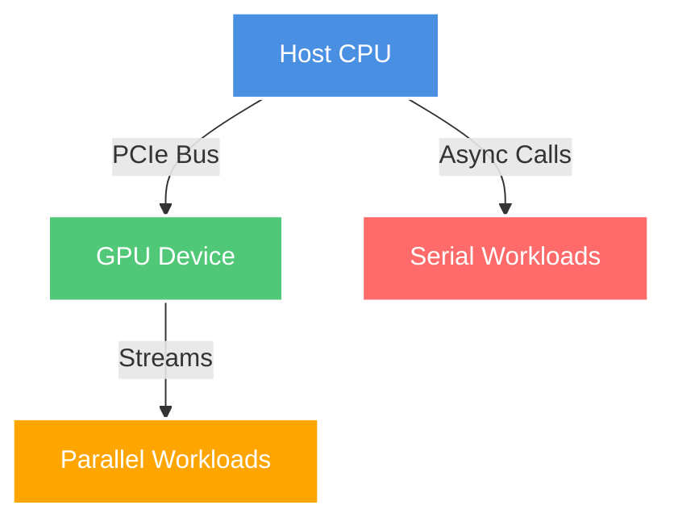
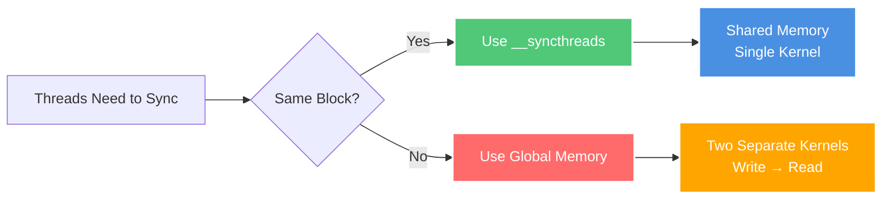
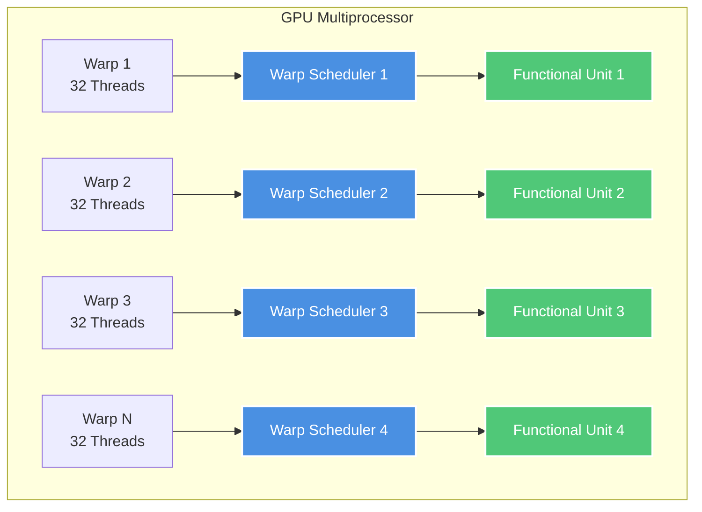
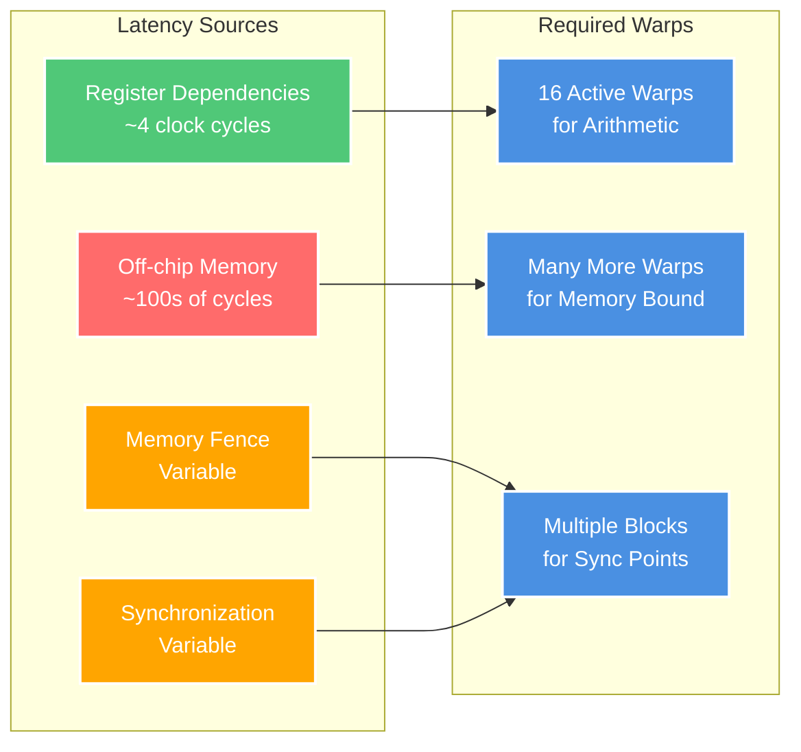
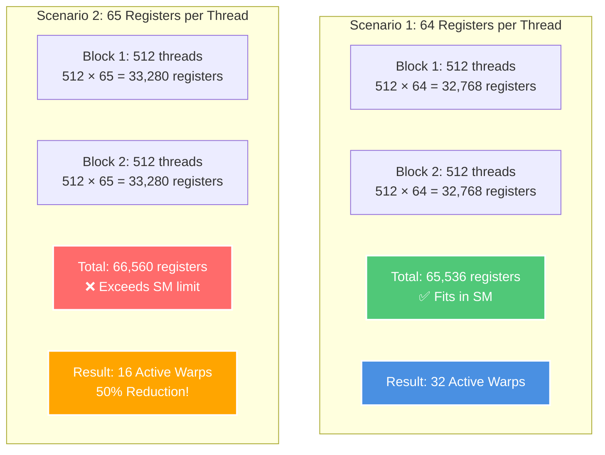
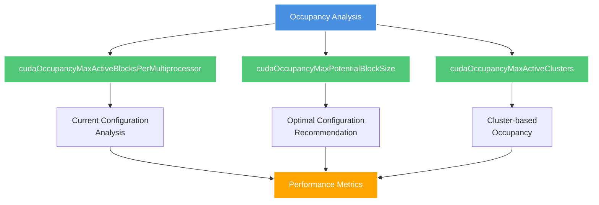

# CUDA Performance Optimization: Maximize Utilization

## 6.2. Maximize Utilization

To maximize utilization, the application should be structured to expose as much parallelism as possible and efficiently map this parallelism to the various components of the system to keep them busy most of the time.

---

## 6.2.1. Application Level

### Key Principles

At a high level, the application should maximize parallel execution between:
- **Host** (CPU)
- **Devices** (GPU)
- **Bus** connecting host to devices

### Architecture Overview



**Explanation**: This diagram shows the optimal workload distribution where the CPU handles serial tasks while the GPU processes parallel workloads, connected via asynchronous operations to maximize throughput.

### Thread Synchronization Strategy



**Explanation**: This flowchart demonstrates the decision process for thread synchronization. Same-block synchronization is much more efficient as it avoids global memory overhead and extra kernel launches.

---

## 6.2.2. Device Level

### Concurrent Kernel Execution

Multiple kernels can execute concurrently on a device using streams to achieve maximum utilization.

```mermaid
gantt
    title GPU Device Utilization Timeline
    dateFormat X
    axisFormat %s
    
    section Stream 1
    Kernel A :active, k1, 0, 3
    Kernel C :k3, 3, 6
    Kernel E :k5, 6, 9
    
    section Stream 2
    Kernel B :active, k2, 1, 4
    Kernel D :k4, 4, 7
    Kernel F :k6, 7, 10
    
    section Stream 3
    Memory Transfer :crit, m1, 2, 3
    Kernel G :k7, 5, 8
```



**Explanation**: This Gantt chart shows how multiple streams enable concurrent kernel execution, maximizing GPU utilization by overlapping computation and memory operations across different streams.

---

## 6.2.3. Multiprocessor Level

### Hardware Multithreading Architecture



**Explanation**: This diagram illustrates how warp schedulers manage multiple warps (groups of 32 threads) and distribute them to functional units, enabling thread-level parallelism within a single multiprocessor.

### Latency Hiding Requirements

#### Compute Capability Requirements

| Compute Capability | Instructions Needed to Hide Latency |
|-------------------|-------------------------------------|
| 5.x, 6.1, 6.2, 7.x, 8.x | **4L** (4 warps × L cycles) |
| 6.0 | **2L** (2 warps × L cycles) |

#### Latency Types and Impact



**Explanation**: Different types of operations create different latency patterns. Register operations have predictable, short latencies, while memory operations require many more warps to hide their longer, variable latencies.

### Resource Impact on Occupancy

#### Register Usage Example (Compute Capability 6.x)



**Explanation**: This example demonstrates how a single additional register per thread can halve the number of active warps, significantly impacting performance. Resource usage must be carefully managed to maintain high occupancy.

---

## 6.2.3.1. Occupancy Calculator

### CUDA Occupancy APIs



**Explanation**: CUDA provides several APIs to analyze and optimize kernel occupancy. Each serves different purposes: analyzing current performance, finding optimal configurations, or working with newer cluster-based launches.

### Occupancy Calculation Example

```cpp
// Device code
__global__ void MyKernel(int *d, int *a, int *b)
{
    int idx = threadIdx.x + blockIdx.x * blockDim.x;
    d[idx] = a[idx] * b[idx];
}

// Host code - Occupancy Analysis
int main()
{
    int numBlocks;        // Occupancy in terms of active blocks
    int blockSize = 32;

    // Device properties for calculations
    int device;
    cudaDeviceProp prop;
    int activeWarps;
    int maxWarps;

    cudaGetDevice(&device);
    cudaGetDeviceProperties(&prop, device);

    // Calculate occupancy
    cudaOccupancyMaxActiveBlocksPerMultiprocessor(
        &numBlocks,
        MyKernel,
        blockSize,
        0);

    activeWarps = numBlocks * blockSize / prop.warpSize;
    maxWarps = prop.maxThreadsPerMultiProcessor / prop.warpSize;

    std::cout << "Occupancy: " << (double)activeWarps / maxWarps * 100 << "%" << std::endl;

    return 0;
}
```

### Automatic Configuration Example

```cpp
// Device code
__global__ void MyKernel(int *array, int arrayCount)
{
    int idx = threadIdx.x + blockIdx.x * blockDim.x;
    if (idx < arrayCount) {
        array[idx] *= array[idx];
    }
}

// Host code - Automatic Optimization
int launchMyKernel(int *array, int arrayCount)
{
    int blockSize;      // Optimized block size
    int minGridSize;    // Minimum grid size for full occupancy
    int gridSize;       // Actual grid size needed

    // Get optimal configuration
    cudaOccupancyMaxPotentialBlockSize(
        &minGridSize,
        &blockSize,
        (void*)MyKernel,
        0,
        arrayCount);

    // Calculate actual grid size
    gridSize = (arrayCount + blockSize - 1) / blockSize;

    MyKernel<<<gridSize, blockSize>>>(array, arrayCount);
    cudaDeviceSynchronize();

    return 0;
}
```

### Cluster Occupancy Analysis

```cpp
// Cluster-based occupancy calculation
{
    cudaLaunchConfig_t config = {0};
    config.gridDim = number_of_blocks;
    config.blockDim = 128; // threads_per_block = 128
    config.dynamicSmemBytes = dynamic_shared_memory_size;

    // Configure cluster attributes
    cudaLaunchAttribute attribute[1];
    attribute[0].id = cudaLaunchAttributeClusterDimension;
    attribute[0].val.clusterDim.x = 2; // cluster_size = 2
    attribute[0].val.clusterDim.y = 1;
    attribute[0].val.clusterDim.z = 1;
    config.attrs = attribute;
    config.numAttrs = 1;

    // Query maximum cluster capabilities
    int max_cluster_size = 0;
    cudaOccupancyMaxPotentialClusterSize(&max_cluster_size, (void *)kernel, &config);

    int max_active_clusters = 0;
    cudaOccupancyMaxActiveClusters(&max_active_clusters, (void *)kernel, &config);

    std::cout << "Max Active Clusters of size 2: " << max_active_clusters << std::endl;
}
```

---

## Key Optimization Guidelines

### ✅ Best Practices

1. **Use Asynchronous Operations**: Overlap CPU and GPU work using streams
2. **Optimize Thread Block Size**: Choose multiples of warp size (32)
3. **Minimize Register Usage**: Balance performance with occupancy
4. **Prefer Shared Memory**: Use same-block synchronization when possible
5. **Use Occupancy APIs**: Let CUDA help find optimal configurations

### ⚠️ Common Pitfalls

1. **Under-populated Warps**: Not using multiples of 32 threads
2. **Excessive Register Usage**: Limiting occupancy unnecessarily
3. **Global Memory Synchronization**: Expensive inter-block communication
4. **Ignoring Latency Hiding**: Not having enough active warps
5. **Static Configurations**: Not adapting to different hardware capabilities

---

## Performance Analysis Tools

- **CUDA Nsight Compute**: Visual occupancy calculator and profiler
- **Occupancy Calculator Header**: `<CUDA_Toolkit_Path>/include/cuda_occupancy.h`
- **Runtime APIs**: Built-in functions for dynamic optimization
- **Profiling Tools**: For measuring actual vs theoretical performance

---

*This guide provides a comprehensive overview of CUDA performance optimization strategies focusing on maximizing utilization across all levels of the GPU hierarchy.*
